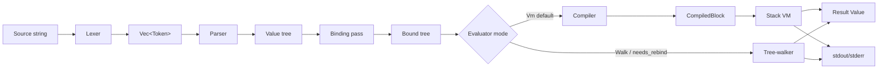
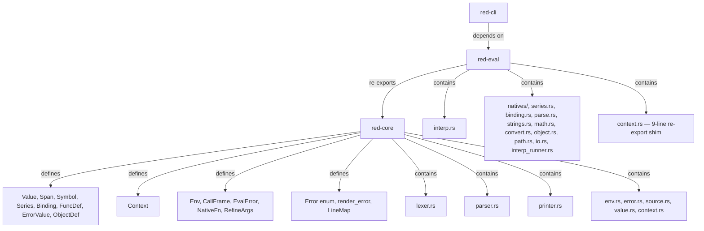

# Architecture

Implementation sketch for the lexer, parser, and evaluator. Companion to
`project-brief.md` (features/scope) — this doc covers *how* each phase works
internally: data structures, dispatch logic, error handling, and hot-path
pseudocode.

## Overview



Crates and ownership:



Note: `Env` / `CallFrame` / `EvalError` / `NativeFn` / `RefineArgs` live in
**`red-core/src/env.rs`** (so the error model and call-frame types are available
to the printer and parser without depending on red-eval). `red-eval/src/context.rs`
is a 9-line `pub use` re-export of those names plus `Context`/`Binding`/`FuncDef`.

## Shared types (red-core)

```rust
pub struct Span { pub start: usize, pub end: usize }  // byte offsets
// derives Clone, Copy, Debug, PartialEq, Eq; Default = Span::new(0,0); is_default() helper

pub struct Symbol(pub Rc<str>);   // interned via `Rc<str>` (string_cache tried & dropped).
                                  // derives Clone, Debug, PartialEq, Eq, Hash

pub struct Series {
    pub data: Rc<RefCell<Vec<Value>>>,
    pub index: usize,
}

pub enum Binding {
    Unbound,
    Local(Rc<Context>, usize),   // shared context + slot index
    Func(usize),   // function-local slot; resolved via the active call frame
    Lexical(usize, usize),   // M23 VM-only: (frame-depth, slot) — resolved via the VM frame stack
    Closure(usize),   // M60: index into the closure's capture cell (`ClosureDef.captures`)
}

pub struct FuncDef {
    pub params: Vec<Symbol>,
    pub refinements: Vec<(Symbol, Vec<Symbol>)>,  // (refinement word, its arg words) — M13
    pub locals: Vec<Symbol>,                      // explicit `<local>` words for `function` — M16
    pub freevars: Vec<Symbol>,                    // M23 lexical capture list
    pub param_types: Vec<Option<Rc<TypesetDef>>>, // M89 per-param runtime type-check; None = unchecked
    pub body: Series,
    pub ctx: Context,            // definition context (owned; cloned per call)
    pub native: Option<NativeFn>,
    pub variadic: bool,
    pub infix: bool,
}

pub type NativeFn = fn(&[Value], &RefineArgs, &mut Env) -> Result<Value, EvalError>;

pub struct RefineArgs {
    inner: Vec<(Symbol, Vec<Value>)>,   // ordered pairs, NOT a HashMap
}
// API: RefineArgs::empty(), from_pairs(Vec), has(&Symbol) -> bool, get(&Symbol) -> Option<&[Value]>

pub struct ErrorValue {                          // M42: full Red field set
    pub message: String,                          // derived/user message body
    pub code: Option<i64>,                        // numeric error code
    pub kind: Option<Symbol>,                     // category word ('math/'script/'user/'io/…)
    pub args: Vec<Value>,                         // values referenced by the template
    pub near: Option<Value>,                      // call-site block/expression
    pub cause: Option<Symbol>,                    // function/frame name where raised
    pub by: Option<Symbol>,                       // actor — calling function name
}

pub struct ObjectDef {                          // M18
    pub ctx: Rc<Context>,
    pub parent: Option<Rc<RefCell<ObjectDef>>>,
    pub self_word: Symbol,                      // seeded with Symbol::new("self")
}

pub enum MapKey {                               // M43 — hashable subset of Value
    Sym(Symbol), Int(i64), Str(Rc<str>), Char(char), Bool(bool), None,
}
// MapKey::from_value(&Value) -> Option<MapKey>  (None for unhashable: blocks/objects/funcs/...)
// MapKey::to_value() -> Value                   (Sym → bare Word)

pub struct MapDef {                             // M43 — insertion-ordered, heterogeneous keys
    pub entries: RefCell<IndexMap<MapKey, Value>>,  // indexmap dep
}
// API: new(), get(&MapKey), set(MapKey, Value), remove(&MapKey), len(),
//      keys() -> Vec<Value>, values() -> Vec<Value>

pub struct MoneyValue {                          // M80 — fixed-point currency (integer cents + 3-letter code)
    pub cents: i64,                              // $10.00 ⇒ 1000 (no floating point)
    pub currency: Rc<str>,                        // default "USD"; mold appends `:EUR` etc. for non-USD
}
// API: new(cents, currency), MoneyValue::parse("$1,234.56:EUR") (lexer)
//      → strips commas, accepts ≥2 fractional digits, 3-letter ccy suffix.
//      Arithmetic: same-ccy `+`/`-` preserves money!; cross-ccy → EvalError::Native
//      ("money error: currency mismatch (CCA vs CCB)"). `money / money` → float (ratio).

pub struct HashDef {                             // M83 — unordered key→value table (HashMap-backed)
    pub entries: RefCell<HashMap<MapKey, Value>>, // real HashMap, NOT indexmap (unspecified order — Red parity)
    pub key_order: RefCell<Vec<MapKey>>,         // insertion-order side vec for `keys-of`/mold
                                                  // determinism in tests only (documented deviation
                                                  // from Red's unspecified `keys-of hash!`)
}
// API: new(), get(&MapKey), set(MapKey, Value), remove(&MapKey), len(),
//      keys() -> Vec<Value> (via key_order), values() -> Vec<Value> (via key_order),
//      pick(idx)/poke(idx, value) — alternating key/value series access (see below).
//      Distinct from `map!`: (1) `series?` true; (2) iteration order unspecified
//      (Red parity — `hash!` is the perf table, `map!` is the ordered one);
//      (3) `=` is order-independent (deep equality on entries).

pub struct BitsetDef {                          // M46 — bit-packed byte set
    pub bits: RefCell<Vec<u64>>,
    pub len: usize,                             // logical bit count (rounded to 64 in storage)
}
// API: new(len), set(byte), clear(byte), test(byte), union/intersect/difference/
//      complement, from_chars(&str), from_range(byte, byte)

pub struct VectorDef {                          // M84 — typed-element numeric series
    pub kind: RefCell<Symbol>,                  // integer!/float!/i8!/…/f64! — drives narrow-on-write
    pub elems: RefCell<Vec<Value>>,             // Vec of Integer/Float (narrowed on write)
    pub cursor: RefCell<usize>,                 // series cursor for next/back/at/skip/head/tail/index?
}
// API: new(kind, elems), empty(kind), pick(idx)/poke(idx, val) — 1-based,
//      narrow(val) (clamp ints; round floats), kind_word(s) -> Option<Symbol>,
//      kind_word_value() -> Value (word form for `vec/integer` path),
//      infer_vector_kind(&[Value]) -> Result<(Symbol, Vec<Value>), String>
//      (int → integer!, float → float!, mixed → float! with promotion).
//      Stored as Vec<Value> for native-compat (packed-array wording is
//      aspirational; perf deferred to v0.8). Full series! model: cursor-backed
//      `next`/`back`/`at`/`skip`/`head`/`tail`/`index?` return a positioned
//      Block view via `extract_series` (documented deviation from Red, where
//      these return a positioned series over the vector's storage).

pub struct ImageDef {                           // M85 — fixed-size 2D RGBA8 pixel buffer
    pub width: usize,
    pub height: usize,
    pub pixels: RefCell<Vec<[u8; 4]>>,          // row-major RGBA8
}
// API: new(w, h, pixels), empty(w, h), len() (== w*h), validate(),
//      from_bytes(w, h, &[u8]) -> Result<Self, String>, to_bytes() -> Vec<u8>,
//      pick(n)/poke(n, &Value) — 1-based flat index, returns/accepts a
//      4-byte tuple! (3-byte tuple! forced opaque, alpha=255),
//      pick_xy(x, y)/poke_xy(x, y, &Value) — 1-based coords (negative from
//      right/bottom edge). image! is NOT a series! — only `length?`/`pick`/
//      `poke` apply; `append`/`insert`/etc. error (size is fixed).
//      Path access: `image/width`/`image/height` → integer; `image/size` →
//      pair!; `image/<n>` → flat pixel pick; `image/<x>x<y>` → coord pick
//      (via `Word("/") + Pair` parser folding — the lexer emits `Word("/")`
//      when `/` is followed by a digit, and the parser folds `Word / Pair`
//      into a path part). Pair set-path (`image/2x1:`) is NOT supported
//      (the lexer only supports `word:`/`digit:` set-path tails); use
//      `poke img n tuple` for pixel writes.

pub struct TypesetDef {                          // M89 — set of type-word symbols for runtime type-checking
    pub types: RefCell<HashSet<Symbol>>,         // 'integer!/'float!/'any-word!/'number!/...
}
// API: new(syms), from_words(&[&str]), is_known_type_word(&Symbol) -> bool,
//      accepts(&Value) -> bool (the runtime type-check — true iff
//      `type_name_for(v)` is in the set literally OR a group word
//      (`any-word!`/`any-path!`/`any-string!`/`any-block!`/`any-object!`/
//      `any-function!`/`number!`/`series!`/`any-type!`) in the set covers
//      `v`), sorted_words() -> Vec<Symbol> (stable mold order), len()/is_empty().
//      Stored on `FuncDef.param_types: Vec<Option<Rc<TypesetDef>>>`
//      (parallel to `params`; `None` = unchecked, back-compat). The func
//      spec parser (`extract_spec` in `natives/func.rs`) recognizes a
//      `[type! ...]` block immediately following a positional param word
//      and builds a `Rc<TypesetDef>` for that slot. Both walker and VM
//      call paths check `param_types[i].accepts(arg)` before binding; on
//      failure they raise `EvalError::Native` with a
//      `"type error: arg N expected [ts], got <found>"` message (the
//      `TypeError.expected: &'static str` field is too narrow for a dynamic
//      typeset label). Typeset *algebra* (`union`/`intersect`/`complement`)
//      deferred to v0.8.

pub struct DateValue {                          // M45 — single variant covers date-only / date+time / date+time+zone
    pub dt: chrono::NaiveDateTime,
    pub zone: Option<i32>,                      // minutes east of UTC; None = zone-naive (matches Red's date!/zone)
}
// API: from_local(dt, zone), date_only(d), has_time(), to_offset_utc(),
//      fixed_offset(), to_zoned(), now_local(), today_local(), to_utc(),
//      from_epoch(secs), from_system_time_local(st)

pub struct ClosureDef {                            // M60 — snapshot-capture closure
    pub func: Rc<FuncDef>,                         // underlying FuncDef (spec/body/ctx)
    pub captures: Rc<Vec<RefCell<Value>>>,         // freevar values, indexed by `freevars` order
}

pub struct ModuleDef {                             // M61 — self-contained namespace
    pub ctx: Rc<Context>,                          // the module's namespace
    pub exports: RefCell<HashSet<Symbol>>,         // words marked `export` (private not in set)
    pub name: Option<Symbol>,                      // for named modules (`module 'foo [...]`)
    pub source: Option<Rc<str>>,                   // canonical path for caching (M62)
    pub parent: Option<Rc<Context>>,               // script user_ctx or another module (reserved v0.6+)
}

pub enum PortScheme {                              // M113 — 12 variants; only File/Http live in v0.6
    File, Http,                                     // live (dispatched)
    Ftp, Smtp, Pop3, Nntp, Dns, Tcp, Udp, Whois, Finger, Daytime,  // reserved → NetError::UnsupportedInV09
}
// API: as_str() -> &'static str, is_live_in_v09() -> bool

pub struct PortState {                             // M113 — open/closed + body/cursor for streaming
    pub open: bool,
    pub cursor: usize,                             // read cursor for streaming reads
    pub http_body: Option<Box<dyn std::io::Read + Send>>,  // ureq body Read, held across read port calls
    pub http_status: u16,
    pub file_handle: Option<std::fs::File>,        // for create/write ports
}

pub struct PortDef {                               // M113 — synchronous port! handle
    pub scheme: PortScheme,
    pub target: Rc<str>,                           // file path or url string
    pub state: RefCell<PortState>,
}
// API: new(scheme, target) -> Rc<RefCell<PortDef>>
```

### Value variants (v0.7)

```rust
pub enum Value {
    None, Unset,                                            // unset! — M86 (synthetic, no span)
    Logic(bool),
    Integer { n: i64, span: Span },
    Float { f: f64, span: Span },
    Percent { value: f64, span: Span },                     // 50% — M80 (stored fractional)
    Money { amount: Rc<MoneyValue>, span: Span },            // $10.00 — M80 (int cents + ccy)
    Issue { s: Rc<str>, span: Span },                       // #ABC — M80
    Email { addr: Rc<str>, span: Span },                   // foo@bar.com — M80
    Tag { text: Rc<str>, span: Span },                      // <b> — M81
    String { s: Rc<str>, span: Span },
    Word { sym, binding, span }, SetWord { .. }, GetWord { .. }, LitWord { .. },
    Block { series: Series, span: Span }, Paren { series: Series, span: Span },
    Func(Rc<FuncDef>),                                    // synthetic — no span; `type?` → native!/op!/function! (M87)
    Path { parts: Vec<Value>, span: Span },              // foo/bar      — M19
    GetPath { parts: Vec<Value>, span: Span },           // :foo/bar     — M19
    LitPath { parts: Vec<Value>, span: Span },           // 'foo/bar     — M19
    SetPath { parts: Vec<Value>, span: Span },           // obj/field:   — M19
    Refinement { sym: Symbol, span: Span },              // /foo         — M13
    File { path: Rc<str>, span: Span },                  // %foo/bar     — M20
    Url { url: Rc<str>, span: Span },                    // http://…     — M20
    String8 { bytes: Vec<u8>, span: Span },              // binary! `#{hex}` — M41 (was a stub)
    Error(Rc<ErrorValue>),                                // caught error value — M16 (M42: full field set)
    Object(Rc<RefCell<ObjectDef>>),                      // make object! — M18 (synthetic, no span)
    Char { c: char, span: Span },                        // #"a" / #"^-" / #"^(41)" — M38
    Map(Rc<RefCell<MapDef>>),                            // make map! — M43 (synthetic, no span)
    Pair { x: Rc<Value>, y: Rc<Value>, span: Span },     // 100x200     — M44
    Tuple { bytes: Rc<[u8]>, span: Span },               // 255.0.0     — M44 (3 or 4 bytes)
    Date { dt: Rc<DateValue>, span: Span },              // 29-Jun-2024/12:30:00+5:30 — M45
    Duration { d: chrono::Duration, span: Span },        // 30s / 1d1h — M140 (signed i64 nanos)
    Bitset(Rc<RefCell<BitsetDef>>),                      // charset "ABC" — M46 (synthetic, no span)
    Closure(Rc<ClosureDef>),                             // closure! — M60 (synthetic, no span)
    Module(Rc<RefCell<ModuleDef>>),                      // module! — M61 (synthetic, no span)
    Port(Rc<RefCell<PortDef>>),                          // port! — M113 (synthetic, no span)
    Hash(Rc<RefCell<HashDef>>),                         // hash! — M83 (synthetic, no span)
    Vector(Rc<RefCell<VectorDef>>),                      // vector! — M84 (synthetic, no span)
    Image(Rc<RefCell<ImageDef>>),                        // image! — M85 (synthetic, no span)
   Typeset(Rc<TypesetDef>),                            // typeset! — M89 (synthetic, no span)
}
```

Every source-origin variant (`Integer`/`Float`/`Percent`/`Money`/`Issue`/
`Email`/`Tag`/`String`/word-family/`Block`/`Paren`/`Path`/`GetPath`/`LitPath`/
`SetPath`/`Refinement`/`File`/`Url`/`Char`/`String8`/`Pair`/`Tuple`/`Date`)
carries the byte-offset `Span` of its originating token so eval-time errors
can render `file:line:col:`. Synthetic variants (`None`/`Unset`/`Logic`/
`Func`/`Error`/`Object`/`Map`/`Bitset`/`Closure`/`Module`/`Port`/`Hash`/
`Vector`/`Image`/`Typeset`) are produced at runtime and carry no span;
error rendering falls back to the call-site span (the originating
`closure`/`module`/`open`/`make` native call's span, attached to the
`EvalError`).

`Value`, `Context`, `Env`, `EvalError` defined as in the brief. Span flow is
covered above — synthetic variants omit the span and fall back to `Span::new(0,0)`
in error rendering.

## Lexer (`red-core/src/lexer.rs`)

### Types

```rust
pub enum TokenKind {
    Integer(i64),
    Float(f64),
    String(Rc<str>),
    Word(Symbol),
    SetWord(Symbol),
    GetWord(Symbol),
    LitWord(Symbol),
    Refinement(Symbol),   // /foo — M13
    File(Rc<str>),         // %foo/bar — M20
    Url(Rc<str>),          // scheme://… detected inside a word run — M20
    Char(char),            // #"a" / #"^-" / #"^(41)" — M38
    Binary(Rc<[u8]>),      // #{hex} — M41
    Pair(i64, i64),        // 100x200 — M44 (also Float×Float via scan_pair)
    Tuple(Rc<[u8]>),       // 255.0.0 / 128.64.32.128 — M44
    Date(Rc<DateValue>),   // 29-Jun-2024[/12:30:00[+5:30]] / 12:30:00-04:00 — M45
    Duration(chrono::Duration), // 30s / 1.5h / 250ms / 1d1h — M140 (signed i64 nanos)
    Percent(f64),          // 50% — M80 (stored fractional: 50% ⇒ 0.5)
    Money(MoneyValue),     // $10.00 / $1,234.56:EUR — M80 (int cents + ccy)
    Issue(Rc<str>),        // #ABC — M80 (`#`-led run; `#"`/`#{` dispatch first)
    Email(Rc<str>),        // foo@bar.com — M80 (word run with `@` + host dot)
    Tag(Rc<str>),          // <b> /  — M81 (raw body between <…>)
    LBracket, RBracket,
    LParen,  RParen,
}

pub enum LexError {
    UnterminatedString { span: Span },
    InvalidNumber { span: Span, chars: String },
    InvalidWord { span: Span },
    UnbalancedBrace { span: Span, depth: i32 },
    InvalidChar { span: Span, chars: String },        // M38 — unterminated #"..." or bad escape
    InvalidBinary { span: Span, chars: String },      // M41 — non-hex in #{...} or unterminated
    InvalidPair { span: Span, chars: String },        // M44 — malformed NxM
    InvalidTuple { span: Span, chars: String },       // M44 — malformed R.G.B
    InvalidDate { span: Span, chars: String },        // M45 — bad DD-Mon-YYYY / out-of-range
    InvalidZone { span: Span, chars: String },        // M45 — bad ±HH:MM suffix
    InvalidPercent { span: Span, chars: String },      // M80 — `NN%` overflow (raw f64 not finite)
    InvalidMoney { span: Span, chars: String },       // M80 — malformed `$…` (non-digit, >2 frac, bad ccy)
    InvalidIssue { span: Span, chars: String },       // M80 — `#` followed by whitespace/delimiter
    InvalidEmail { span: Span, chars: String },       // M80 — `@` with empty local/host or no host dot
    UnterminatedTag { span: Span, chars: String },    // M81 — `<…` hit EOF before `>`
}

pub struct Token {
    pub kind: TokenKind,
    pub span: Span,
}
```

### Scan loop (pseudocode)

```
fn lex(src: &str) -> Result<Vec<Token>, LexError>:
  let mut out = []
  let mut i = 0
  while i < src.len():
    c = src[i]
    if c is whitespace or c == ',': i++; continue   // ',' is whitespace (Red)
    if c == ';': skip to EOL; continue
    if c == '[': push LBracket; i++; continue
    if c == ']': push RBracket; i++; continue
    if c == '(' : push LParen;  i++; continue
    if c == ')': push RParen; i++; continue
    if c == '"': (span, s, i) = scan_quoted(src, i)?
    if c == '{': (span, s, i) = scan_braced(src, i)?
    if c is digit or ('-' followed by digit):
        (span, tok, i) = scan_number(src, i)?
    else:
        (span, tok, i) = scan_word(src, i)?   // also catches :foo 'foo foo: %file url://...
    push Token { kind: tok, span }
  return out
```

### Per-token scanners

- `scan_number`: read run of `[0-9]`, then optional `.` + digits → Float, else
  Integer. Reject `1.2.3`. Honor `e`/`E` exponent for floats. **M38 follow-up:**
  a digit run immediately followed by a single `:` emits `Integer(n)` + an
  overlapping-span `SetWord("n")` so the parser folds `b/2:` / `s/2:` into a
  `SetPath` with an `Integer` final part (unblocks block-integer and string-char
  poke). **M44:** the main scan loop's digit branch peeks the full non-delimiter
  run *before* dispatching to `scan_number` — an `x` between digit-led runs
  routes to `scan_pair`; 2+ dots between digit-only runs routes to `scan_tuple`.
  (`scan_number`'s 2nd-dot `InvalidNumber` error becomes unreachable for 2-3-dot
  runs but remains for defensive coverage.)
- `scan_char` (`#"..."` — M38): single char, caret escape (`^-` tab, `^/`
  newline, `^@` null, `^M` CR, `^^` literal caret, `^"` literal quote), or
  `^(NN)` codepoint hex. Error `InvalidChar` on unterminated `#"` or bad escape.
- `scan_binary` (`#{hex}` — M41): hex digits (contiguous, no internal
  whitespace) until `}`. Odd digit count → high nibble zero-padded (`#{ABC}`
  → `[0x0A, 0xBC]`). Error `InvalidBinary` on non-hex or unterminated.
- `scan_pair` (`NxM` — M44): two integers or floats separated by `x`
  (e.g. `100x200`, `1.5x2.5`). Error `InvalidPair` on malformed forms.
- `scan_tuple` (`R.G.B[.A]` — M44): 3 or 4 dot-joined integers 0-255.
  Error `InvalidTuple` on out-of-range or malformed forms.
- `scan_date` (`DD-Mon-YYYY` / `YYYY-MM-DD` — M45): with optional `/HH:MM:SS[.mmm]`
  time suffix and optional `+HH:MM`/`-HH:MM`/`+HHMM`/`+HH`/`Z` zone suffix.
  `DD/MM/YYYY` is **not** supported (`/` is a delimiter). ISO `T` separator
  (uppercase only — lowercase `t` appears in month abbreviations like `Oct`).
  Errors: `InvalidDate` / `InvalidZone`.
- `scan_quoted` (`"..."`): read until unescaped `"`. Escape table: `\"`, `\\`,
  `\n`, `\t`, `\r`; **unknown escapes are kept verbatim with the backslash**
  (e.g. `"\q"` yields `\q`). No `^H`-style caret escapes — those are deferred.
  Error if EOF before closing quote.
- `scan_braced` (`{...}`): depth counter starting at 1; nested `{`/`}` adjust.
  Newlines preserved. Error if EOF with depth > 0.
- `scan_word`: read run of non-delimiter chars. Delimiter set = whitespace +
  `,` + `[` `]` `(` `)` `{` `}` `;` `"` `/`. (Note `/` is a delimiter so
  `foo/bar` splits into `Word("foo") Refinement("bar")` — the parser re-folds
  these into a `Path`.) Then classify:
  - leading `:` → GetWord
  - leading `'` → LitWord
  - leading `%` → File (bare `%foo/bar.txt` or quoted `%"with spaces.txt"`)
  - trailing `:` → SetWord (single trailing colon only)
  - `scheme://...` (alpha scheme + literal `://`) → Url
  - bare `/` (not followed by word chars / digit) → `Word("/")` (division)
  - bare `//` → `Word("//")` (modulo operator, one token)
  - otherwise → Word
  Intern each symbol immediately.

### Error strategy
Single-character lookahead, no backtracking. Every error carries a `Span`
so the parser/CLI can point at the offending bytes.

## Parser (`red-core/src/parser.rs`)

### Types

```rust
pub struct Parser<'a> {
    tokens: &'a [Token],
    pos: usize,
}

pub enum ParseError {
    Unexpected { found: TokenKind, span: Span, expected: &'static str },
    MissingClose { open: Span, kind: &'static str },
    EmptyInput,
}
```

### Entry points

```rust
pub fn parse_program(toks: &[Token]) -> Result<(Series /*header*/, Series /*body*/), ParseError>;
pub fn load(toks: &[Token]) -> Result<Series /*body*/, ParseError>;  // bare body
pub fn load_source(src: &str) -> Result<Series /*body*/, Error>;     // lex + load in one call
```

### parse_value dispatch (pseudocode)

```
fn parse_value(&mut self) -> Result<Value, ParseError>:
  tok = self.peek()?
  match tok.kind:
    LBracket: return self.parse_block()       // consumes [ ... ]
    LParen:   return self.parse_paren()        // consumes ( ... )
    Integer(n) => advance; Value::Integer(n)
    Float(f)   => advance; Value::Float(f)
    String(s)  => advance; Value::String(s)
    Word(w)    => advance; Value::Word { sym: w, binding: Unbound }
    SetWord(w) => advance; Value::SetWord { sym: w, binding: Unbound }
    GetWord(w) => advance; Value::GetWord { sym: w, binding: Unbound }
    LitWord(w) => advance; Value::LitWord(w)
    other: Err(Unexpected { ... })
```

### parse_block (pseudocode)

```
fn parse_block(&mut self) -> Result<Value, ParseError>:
  open = self.consume(LBracket)?
  let mut items = vec![]
  while self.peek()?.kind != RBracket:
    if at EOF: Err(MissingClose { open, kind: "block" })
    items.push(self.parse_value()?)
  close = self.consume(RBracket)?
  return Value::Block(Series {
      data: Rc::new(RefCell::new(items)),
      index: 0,
  })  // span = open.start .. close.end
```

`parse_paren` is identical with `LParen`/`RParen` and `Value::Paren`.

### Header handling
`parse_program` peeks first token; if it's `Word("Red")`, consumes it,
consumes one header block (must be `[...]`), then parses **the rest of the
stream as a flat body `Series`** (the body need not be wrapped in its own
`[...]`). Otherwise treats the whole stream as body (matches `load`).

### Path assembly (parser-level)
`parse_value` folds adjacent `Refinement` tokens (and `Word("/")`+value pairs
for paren/integer parts) into a single `Path`/`GetPath`/`LitPath`/`SetPath`
*inline* during the recursive descent — there is no separate post-pass. The
head determines the variant: `Word`→`Path`, `GetWord`→`GetPath`,
`LitWord`→`LitPath`. `SetPath` (`obj/field:`) is detected when the trailing
`SetWord`'s name matches the last `Refinement` and their spans overlap (the
lexer emits `Word(obj) Refinement(field) SetWord(field)` with overlapping
spans — see lexer's `scan_word`). Path parts may include `Paren`
(e.g. `foo/(1 + 2)/bar`).

### Binding pass
**The parser does NOT bind words.** Binding is a separate pass in
`red-eval/src/binding.rs`, invoked from `interp::run_series_inner_opts`
(and from the REPL) right before evaluation. The pass walks the body
recursively and attaches `Binding`s using the user context:

- `collect_setwords` — every `SetWord` at the top level of the body allocates
  a fresh slot in the user context and rewrites its `binding` to
  `Local(user_ctx, slot)`. Matching `Word`s get the same binding.
- `collect_loop_vars` — names bound by `repeat`/`foreach`/`forall` are
  pre-allocated as locals so the iteration word resolves.
- `collect_parse_words` — `copy`/`set` capture words inside a `parse` rule
  block are bound into the user context.
- `use`/`get`/`set`/`value?` operands are also wired so their word argument
  resolves to the right context slot.

Words that don't match anything stay `Unbound` and resolve at eval time
(function locals, natives). Function bodies are *not* bound here — they're
bound when `func`/`does`/`function`/`make object!` runs (via
`bind_function_body`, which binds field references to the function's or
object's context).

### Errors
Every error carries the span of the offending token so the CLI can render
`file.red:line:col: error: ...`.

## Evaluator (`red-eval/src/interp.rs` + `interp_walker.rs` + `interp_runner.rs`)

### Compiler & VM (v0.3)

Since M29 (v0.3), the default evaluator is a **bytecode compiler + stack VM**.
The compiler (`red-eval/src/vm/compiler.rs`) walks a parsed, M23-analyzed
`Series` and emits a flat `Vec<Instr>` plus a constant pool, returning a
`CompiledBlock`. The VM (`red-eval/src/vm/vm.rs`) is a straightforward stack
machine: each instr pushes/pops `Value`s on the operand stack, function calls
push `Frame`s on the call stack, and control flow mutates the frame's `pc`.
Lexical addressing walks the frame chain — `LoadLocal(d, slot)` reads from
`frames[len-1-d].locals[slot]`. Key features:

- **Scope analysis** (M23, `vm/lex.rs`): `analyze_block` walks the parsed
  block tracking a compile-time `Scope`, attaching `Binding::Lexical(depth,
  slot)` to function-local words and computing `freevars` per block.
- **Tail-call optimization** (M28): `CallUser` in tail position is rewritten
  to `TailCall`/`TailReenter` (`patch_tail_call`); the VM reuses the current
  frame, bounding call-stack depth for tail-recursive programs.
- **Compiled-block caches** (M27): `env.func_cache` (keyed by `Rc::as_ptr(fd)`)
  for function bodies, `env.block_cache` (keyed by `(Rc::as_ptr(&series.data),
  series.index)`) for `do`-ed / loop-body blocks. Both use a secondary
  `source_span` equality check to defeat allocator-reuse (M29 ABA fix).
- **Native bridge** (M26): natives keep their existing `NativeFn` signature;
  the VM assembles `&[Value]` by slicing the top `argc` stack slots and
  `RefineArgs` by collecting `MarkRefine`/`EndRefine`-bracketed regions.
  Natives that recurse into block evaluation call `dispatch_block`, which
  routes to the VM (compile-on-demand) or walker (`needs_rebind`/foreign).
- **Per-instr spans** (M31): `CompiledBlock.spans: Rc<[Span]>` (parallel to
  `instrs`) localizes VM-raised `EvalError`s to the offending instr; `disasm`
  prints `file:line:col` annotations.
- **Tracing** (M31): `Env::trace_out: Option<Box<dyn Write>>` — when `Some`,
  the VM emits `pc={pc} {instr:?}` per instr.

The tree-walker (`interp_walker.rs`) is retained as the `--walk` fallback and
the path for `needs_rebind`-flagged blocks (`use`/`make object!`/foreign-bound).
See the "Performance" section below for the optimization tiers (M30–M30.3).

### Dispatch shim

Since M29 (v0.3), the evaluator is split into a thin dispatch shim
 (`interp.rs`), the original tree-walker (`interp_walker.rs`), and the
 script entry-point plumbing (`interp_runner.rs`). M36 extracted the
 `run_source*`/`run_series*`/`RunOptions` entry points out of the walker
 into `interp_runner.rs` (shrinking the walker by ~150 lines + its test
 module). The default mode is the bytecode VM (`EvalMode::Vm`); `--walk` on
 the CLI or the `force-walk` cargo feature forces the tree-walker. The
 shim's `eval(block, env)` checks `env.mode`: `Walk` →
 `interp_walker::eval` directly; `Vm` → `dispatch_block`
 (compile-on-demand + `vm::run`, falling back to the walker for
 `needs_rebind`/foreign-bound/compile-error blocks).
 `run_series_inner_opts` (in `interp_runner.rs`) calls `dispatch_block`
 (not `eval` directly) so the
top-level script body honors `env.mode`. `call_user_func` (the walker's
function-call shim) calls `interp_walker::eval` directly — function bodies
invoked from the walker always stay on the walker (the VM uses its own
`vm.frames`, not `env.call_stack`). In pure VM mode, the VM's `CallUser`
handler is the function-invocation path.

### Types

```rust
pub struct Env {
    pub user_ctx: Rc<Context>,                 // shared (Rc) so the REPL & binding pass can mutate
    pub call_stack: Vec<CallFrame>,
    pub natives: HashMap<Symbol, Rc<FuncDef>>, // full FuncDef so infix/variadic/refinements flow
    pub out: Box<dyn Write>,                   // stdout sink; tests inject a buffer
    pub allow_shell: bool,                     // M20: gates `call`/`shell`
    pub allow_network: bool,                   // M113: gates `open url!`/`read url!`/HTTP-port reads (default off)
    pub unset_on_unbound: bool,                // M86: when true, an unbound word evaluates to `Value::Unset`
                                               //   instead of raising `EvalError::UnboundWord`. Default false
                                               //   (back-compat — all existing unbound-word fixtures stay green).
                                               //   Toggled by the `--unset-on-unbound` CLI flag. Both the
                                               //   walker's `resolve_word` `Unbound` arm and the VM's
                                               //   `LoadDynamic` arm consult this gate.
    pub cwd: PathBuf,                          // M20: base dir for file I/O
    pub mode: EvalMode,                        // M29: `Vm` (default) or `Walk`
    // VM compiled-block caches (M27) + scratch Vec pools (M30.1.C/M30.3.2) —
    // func_cache, block_cache, natives_by_idx, vm_frames_pool, vm_stack_pool,
    // vm_locals_pool, trace_out (M31). See env.rs for full field list.
    pub module_stack: Vec<Rc<RefCell<ModuleDef>>>, // M61: currently-evaluating module bodies
    pub modules: HashMap<Symbol, Rc<RefCell<ModuleDef>>>,       // M61: named-module cache
    pub modules_by_path: HashMap<PathBuf, Rc<RefCell<ModuleDef>>>, // M62: file-import cache
    pub loading_modules: Vec<PathBuf>,         // M65: in-flight import paths (circular-import guard)
    pub current_vm_captures: Option<Rc<Vec<RefCell<Value>>>>, // M60: active closure captures (for dispatch_block)
    pub stdlib: Option<Rc<RefCell<ModuleDef>>>, // M63: auto-imported stdlib cache
}

pub struct CallFrame {
    pub ctx: Context,        // function-local context (owned, cloned per call)
    pub func: Option<Rc<FuncDef>>,
    pub captures: Option<Rc<Vec<RefCell<Value>>>>,  // M60: closure capture cell (None for plain funcs)
}

pub enum EvalError {
    UnboundWord { sym: Symbol, span: Span },
    TypeError { expected: &'static str, found: &'static str, span: Span },
    Arity { native: Symbol, expected: usize, got: usize, span: Span },
    Return(Value),                 // control-flow unwind from `return`
    Break(Option<Value>),          // control-flow unwind from `break`
    Continue,                      // control-flow unwind from `continue` (no value)
    Throw(Value),                  // M16: `throw` / `catch` unwind
    Quit(i32),                     // M16: `exit` / `quit` unwind (process exit code)
    Native { message: String, span: Span },
    Raised(Rc<ErrorValue>),         // M42: structured error (cause-error / synthesized)
    Compile { kind: CompileErrorKind, span: Span },  // M31: compiler/VM invariant violation
    ParseRecursionLimit { span: Span },  // M110: parse sub-rule recursion depth exceeded
}
```

**v0.5 closure/module error sources:** no new `EvalError` variants were
added for closure capture OOB, module private access, `export` outside
module, `import` file-not-found, or circular import. They all reuse
`Native { message, span }` (with a `closure:`/`import:`/`export:` message
prefix) or `UnboundWord` (for module-private-from-outside access, which
matches `in_native`'s absent-word behavior). The M65 audit normalized
the message prefixes and added walker bounds-checks for capture OOB parity
with the VM. Circular-import detection uses `Env::loading_modules`.

`Env`, `CallFrame`, `EvalError`, `NativeFn`, and `RefineArgs` are all defined
in **`red-core/src/env.rs`** (so red-core's printer/parser can mention
`EvalError`/`Error` without a red-eval dependency). `red-eval/src/context.rs`
is just `pub use red_core::{Binding, CallFrame, Context, Env, EvalError,
FuncDef, NativeFn, RefineArgs};`.

`EvalError::span()` returns `Some(span)` for `UnboundWord`/`TypeError`/
`Arity`/`Native`/`Compile`, the `near` value's span for `Raised` (if set),
and `None` for every control-flow unwind (`Return`/`Break`/
`Continue`/`Throw`/`Quit`). `EvalError::Display` renders just the message
body (no `*** Error:` prefix, no location). The `render_error(file:
Option<&str>, src: &str, err: &Error)` function in `red-core/src/error.rs`
produces the full Red-style diagnostic line `*** Error:
[file:line:col: ]<msg>` using a `LineMap` (defined in
`red-core/src/source.rs`, precomputed line-start offsets) to translate the
error's byte-offset `Span` into 1-based `line:col`. The CLI passes
`Some(path)` + the file source; the REPL passes `None` + the line buffer.
Errors whose span is `None` or the zero placeholder (`Span::new(0,0)`, used
by synthetic values) omit the location. `Error` (also in
`red-core/src/error.rs`) is the unified `enum { Lex, Parse, Eval }` with
`From` impls for each sub-error.

### Main eval loop (pseudocode)

```
fn eval(block: &Value, env: &mut Env) -> Result<Value, EvalError>:
  let series = match block { Block(s) | Paren(s) => s, _ => return Ok(block.clone()) }
  let mut last = Value::None
  let data = series.data.borrow()
  let mut i = series.index
  while i < data.len():
    let v = &data[i]
    last = match v {
      Integer(_) | Float(_) | String(_) | None | Logic(_) | LitWord(_) | Block(_) | Func(_) => v.clone(),
      Paren(s) => eval(&Value::Paren(s.clone()), env)?,  // eager
      Path(parts) => eval_path(parts, env, v.span())?,
      Word { sym, binding } => resolve_word(*sym, binding, env, v.span())?,
      SetWord { sym, binding } => {
        i += 1
        let rhs = eval_one(&data[i], env)?
        write_setword(*sym, binding, rhs, env, v.span())?
        last
      }
      GetWord { sym, binding } => resolve_word(*sym, binding, env, v.span())?,
    }
    i += 1
  Ok(last)
```

### Word resolution

```
fn resolve_word(sym, binding, env, span) -> Result<Value, EvalError>:
  match binding:
    Local(ctx, slot) => Ok(ctx.slot(slot).clone()),
    Func(idx)        => Ok(env.call_stack.last().unwrap().ctx.slot(idx).clone()),
    Lexical(d, slot) => Ok(vm.frames[frames.len()-1-d].locals[slot].clone()),  // VM-only
    Closure(idx)     => Ok(env.call_stack.last().unwrap().captures.as_ref().unwrap()[idx].borrow().clone()),
    Unbound          =>
      // M62 behavior change: consult user_ctx *first* (so `import`/`set`
      // aliases resolve), then the native registry, then error (or
      // M86-gated: return `Value::Unset` instead of erroring).
      if let Some(v) = env.user_ctx.get(sym): Ok(v)
      else if let Some(fd) = env.natives.get(sym): Ok(Value::Func(fd.clone()))
      else if env.unset_on_unbound: Ok(Value::Unset)   // M86 — gated, default off
      else: Err(UnboundWord { sym, span })
```

(The `Unbound → user_ctx` fallback is the one v0.5 behavior change, M62:
required so `import`-aliased words resolve without AST re-walking. The
VM's `LoadDynamic` already consulted `user_ctx`; the walker now matches.
The walker bounds-checks `captures[idx]` (M65 parity with the VM's
`LoadCapture`/`SetCapture` guards). **M86** adds the gated
`unset_on_unbound` branch: when `Env.unset_on_unbound` is true (set by the
`--unset-on-unbound` CLI flag, default false), a truly-unbound word
evaluates to `Value::Unset` instead of raising `EvalError::UnboundWord`.
The VM's `LoadDynamic` arm has the same gate. Default-off preserves
back-compat — all existing unbound-word error fixtures stay green.)

### Native dispatch
The `Env.natives` map stores `Rc<FuncDef>` (not bare `NativeFn`) so the
`infix`/`variadic`/`refinements`/`locals` metadata flows through to dispatch.
When a `Word` resolves to a `Value::Func(fd)` whose `native` is `Some(f)`:
- Collect arguments by evaluating the next N values in the current block
  (N = `fd.params.len()`).
- Call `f(args, refs, env)`.
- For non-native `Func` values (user-defined via `func`/`does`):
  - Push a `CallFrame { ctx: child_ctx(fd), func: Some(fd) }` where
    `child_ctx` binds each param symbol to the corresponding arg.
  - `eval(&Value::Block(fd.body.clone()), env)`
  - Pop frame.
- `return` native: `Err(EvalError::Return(value))` caught by the function
  call shim and converted to the return value.

**M89 typed-func arg type-check:** `FuncDef.param_types: Vec<Option<Rc<TypesetDef>>>`
is a parallel vec to `params` (`None` = unchecked, back-compat with all
pre-M89 funcs). The func spec parser (`extract_spec` in `natives/func.rs`)
recognizes a `[type! ...]` block immediately following a positional param
word and builds a `Rc<TypesetDef>` for that slot. Both walker (`call_user_func`/
`call_closure_func`) and VM (`prepare_call`) call paths run
`check_param_types(fd, &args)` (walker) or inline the check (VM) before
binding args: for each `i` where `param_types[i].is_some()`, they call
`ts.accepts(&args[i])`; on failure they raise `EvalError::Native` with a
`"type error: arg N expected [ts], got <found>"` message (the
`TypeError.expected: &'static str` field is too narrow for a dynamic
typeset label, so `Native` with a formatted message is used — the v0.7
pattern for M80/M84/M85 rich errors). `typeset_label(ts)` molds the
expected set as `[w1 | w2 | ...]`. The `param_types.is_empty()` fast path
means pre-M89 funcs pay only one `Vec::is_empty` check per call.
`TypesetDef::accepts` recognizes the `any-*` family (`any-word!`/`any-path!`/
`any-string!`/`any-block!`/`any-object!`/`any-function!`/`number!`/`series!`/
`any-type!`) via a `group_members(group)` table in `value.rs`.

**M87 `native!`/`op!` split:** `Value::Func` keeps its `FuncDef.native`/
`FuncDef.infix` flags (no sweeping match-arm refactor), but `type?`/
`native?`/`op?`/`any-function?`/`types-of` report them as distinct types:
a `Func` with `native.is_some() && !infix` is `native!`; with `infix` is
`op!`; otherwise `function!`. `Value::Closure` is `closure!`.
`native?`/`op?` are disjoint (`+` is `op!` not `native!`); `function?`/
`any-function?` cover all four. `types-of` lists the umbrella
`any-function!` alongside the specific word.

### Refinement dispatch (M13)
A function spec may declare refinements: `func [x /with y]` populates
`FuncDef.refinements` with `("with", ["y"])`. At a call site, refinements
arrive in two shapes:
- **Path form** (`copy/part x`) — the parser folds `copy` + `/part` into a
  `Value::Path` whose tail words are extracted as *leading refinements*
  before dispatch.
- **Spaced form** (`copy /part x`) — `collect_call_args` peeks the next
  value; a matching `Value::Refinement` token is consumed and the
  refinement is activated.

`collect_call_args` walks positional params first, then `fd.refinements`
in declaration order. An activated refinement collects its arg words; an
absent refinement contributes nothing. The result is `args: &[Value]`
plus a `RefineArgs` (an ordered `Vec<(Symbol, Vec<Value>)>` — not a
HashMap) of `name -> &[Value]`. `NativeFn` takes both:
`fn(args, refs, env)`. Natives query `refs.has(&sym)` / `refs.get(&sym)`.
Refinement-arg exhaustion raises `EvalError::Native` naming the offending
refinement (e.g. `"copy: refinement /part expects 1 argument(s), got 0"`)
rather than a generic arity message.

### Path resolution (M19)
`Value::Path` (and `GetPath`/`LitPath`/`SetPath`) is assembled by the
parser when a word is immediately followed by `/word` tokens. Evaluation:
- **Function-headed** (`copy/part …`) — the tail is treated as leading
  refinements and dispatched via the refinement collector above.
- **Object-headed** (`obj/field`) — `obj` resolves, then `select_object_path`
  walks the tail. Each `Word` part selects an object slot; the final part
  may be a method call if the selected value is a `Func` and trailing
  block args are available.
- **Data-headed** (`block/2`, `string/3`) — `walk_data_path` steps through
  the tail: `Word` → object field select; `Integer` → 1-based `pick`
  (negative from tail, out-of-range → `none`); `Paren` → evaluated in
  place as the selector (`b/(1 + 1)`).
- **Map-headed** (`m/word`, `m/2`, `m/"str"`, `m/#"c"` — M43) — the tail
  part is converted to a `MapKey` (`Word`→`Sym`, `Integer`→`Int`, `String`→
  `Str`, `Char`→`Char`) and `MapDef::get` is called. Word keys also try the
  string form if the `Sym` lookup misses (so `m/foo` finds a `Str("foo")`
  key). `SetPath` (`m/word: value`) calls `MapDef::set`.
- **Hash-headed** (`h/word`, `h/2`, `h/"str"` — M83) — mirrors the map-headed
  rule: tail → `MapKey`, `HashDef::get`/`set`. `SetPath` (`h/key: value`)
  calls `HashDef::set` (inserts/replaces the entry, appends to `key_order`
  on first insertion). Order-independent `=` (two hashes with the same
  entries in different insertion order are `equal?`).
- **Pair-headed** (`p/x`, `p/y` — M44) — returns the `x`/`y` component.
  `SetPath` rebuilds an immutable `Pair` with the new component.
- **Tuple-headed** (`t/r`/`t/g`/`t/b`/`t/a` — M44) — returns the byte at
  the named slot. `SetPath` rebuilds an immutable `Tuple`.
- **Date-headed** (`d/year`/`month`/`day`/`time`/`weekday`/`yearday`/`week`/
  `zone` — M45) — returns the named component as an `Integer` (or `none`
  for `time`/`zone` on a date-only value). `date/zone:` **relabels** the
  offset only (does not shift `dt`); accepts a time-shaped date, integer
  (minutes), or `none`. `to-utc` is the shift-and-relabel convenience.
- **Email-headed** (`em/user`, `em/host` — M80) — returns the local part
  (`user`) or host part (`host`) as a `string!`. `email/other` →
  `EvalError::Native` ("email! has no field other (only /user and /host)").
  No `SetPath` (email! is immutable).
- **Vector-headed** (`v/integer`/`v/float`, `v/N` — M84) — `v/integer`
  returns the kind word as a `word!` value (`'integer!`/`'float!`); `v/N`
  is 1-based `pick` (returns `Integer`/`Float`, not a length-1 vector!).
  `v/N: value` is path-as-poke (narrows to the vector's kind: clamp ints,
  round floats).
- **Image-headed** (`img/width`/`height`/`size`, `img/N`, `img/XxY` — M85)
  — `img/width`/`img/height` → integer; `img/size` → pair (`width x
  height`); `img/N` → flat 1-based pixel pick (returns a 4-byte
  `tuple!`); `img/XxY` → coord pick (1-based coords, via `Word("/")` +
  `Pair` parser folding). Integer `SetPath` (`img/N: tuple`) writes the
  pixel; Pair `SetPath` (`img/2x1:`) is NOT supported (the lexer only
  supports `word:`/`digit:` set-path tails); use `poke img n tuple` for
  pixel writes.
- **Literal-headed** (`100x200/x`, `255.0.0/r` — M44) — `parse_value` calls
  `assemble_path` for `Pair`/`Tuple` heads (and `Block` heads); the head
  value is the data itself (no word resolution), the tail walks via
  `walk_data_path`. Also enables 0-refinement native paths like `now/year`
  (call the 0-arity func, then walk the data path).

Per-step errors (missing field, type mismatch) localize to the offending
part's own span, not the whole path's. `SetPath` (`obj/field: value`)
walks to the second-to-last part, then writes the evaluated RHS into the
final field (object slot) or index (`poke`).

**POC caveats:**
- **String char pick** (`"abc"/2`): returns a `char!` (M38). String char
  *poke* (`s/2: #"X"`) also works (M38 follow-up: the lexer now emits
  `Integer(n)` + `SetWord("n")` with overlapping spans for `2:`, and the
  parser folds the run into a `SetPath` with an `Integer` final part;
  `set_path_value` rebuilds the immutable `Rc<str>` and writes the new
  string back to the head word's binding).
- **Block-integer SetPath** (`b/2: 99`): works as of M38 follow-up. The
  lexer emits `Integer(n)` + `SetWord("n")` (overlapping spans) for a
  digit run followed by a single `:`; the parser folds via the existing
  span-overlap SetPath detection. (Previously unreachable — a pre-existing
  compiler bug where `Instr::Const(path_idx)` was never emitted in the
  `SetPath` arm was also fixed.)
- **Path-conversion natives** (in `path.rs`, registered alongside the path
  machinery): `path?`, `get-path?`, `lit-path?`, `to-path`, `to-get-path`,
  `to-lit-path`. (`set-path?` is intentionally omitted.)

### Objects (M18)
`Value::Object(Rc<RefCell<ObjectDef>>)` wraps an ordered word→value
`Context` plus an optional prototype `parent`. `make object! [spec]`
evaluates the spec block with `self` bound to a fresh context; set-words
in the spec populate slots. Inheritance is copy-based: a child
`make object! parent [...]` pre-seeds from the parent's words/values, then
evaluates the spec (which may override). Method bodies bind to the
object's context via the standard binding pass — no special binding
variant. `in object 'word` returns a `Word` bound into the object's slot
(registered in `object.rs`, not `binding.rs`); `words-of`/`values-of`/
`reflect` introspect it. The `object` and `context` keywords are aliases
for `make object!` (arity 1, spec block). Object predicates:
`object?`, `same?`, `not-same?`.

### Block vs Paren, system, and entry points
- **Block vs Paren (recap)**: a `Block` sitting in a block being walked is
  returned as data; a `Paren` is entered eagerly. Natives like `do`, `if`,
  `loop`, `parse` receive a `Block` argument and call `eval` on it
  themselves. (`compose` is **not** implemented — deferred to v0.3; don't
  expect it in the block-walker list.)
- **`system` constant**: `install_system` seeds a `system` object into the
  user context exposing `system/options/args` (trailing CLI args),
  `system/options/allow-shell` (mirrors `Env.allow_shell`), and
  `system/options/path` (mirrors `Env.cwd`, kept in sync by `change-dir`).
- **Entry points**: `interp` exposes `eval` (the inner loop) plus
  `run_source*` / `run_series_with_exit_opts` helpers driven by
  `RunOptions { allow_shell, args }`. `run_source_with_exit` returns
  `(Option<Value>, i32)` so the CLI can propagate the `quit`/`exit` code.

### Series natives
Live in `series.rs`, registered in `natives/registry.rs`. Each takes `&[Value]`,
extracts its `Series` argument(s), manipulates the cursor or `RefCell`
contents, returns a `Value`. Mutation affects shared storage (Red
reference semantics).

**`sort` + set operations (M112):** `sort` is an in-place stable native
(default ascending; refinements `/case`/`/reverse`/`/skip size`/`/compare
func`) over `block!`/`string!`. The total order reuses `compare.rs`'s
numeric/string comparison; mixed-type blocks fall back to a pragmatic
`(type_name, mold)` total order — a documented POC deviation (sort never
errors on mixed types). `unique`/`intersect`/`union`/`difference`/`exclude`
operate on `block!`/`string!` (first-occurrence-order-preserving). The same
native names dispatch on `bitset!` operands to the M46 implementations in
`bitset.rs`. `sort`/`unique`/`intersect`/`union`/`difference`/`exclude` all
support `/case` (string case-sensitivity) and `/skip size` (record-wise).

**`hash!` series model (M83):** `hash!` IS a `series!` (unlike `map!`).
`extract_series(&Value::Hash)` returns a positioned `Block` view over the
flat alternating key/value pair sequence (`[k1 v1 k2 v2 ...]`). Series ops
behave accordingly:
- `length? h` → `2 * entry_count` (alternating).
- `pick h N` → key at index `2n`, value at index `2n+1` (1-based).
- `poke h N value` → writes at the corresponding slot (key slot if even
  index, value slot if odd — the key slot poke updates `key_order` too).
- `foreach [k v] h [...]` works (series iteration).
- `select`/`find` (by key) — same as `map!`.
- `append`/`insert` (as a series — append a key/value pair).
- `clear`/`empty?`.
Iteration order in `keys-of`/`values-of`/`mold` uses the side `key_order`
vec for test determinism (documented deviation from Red's unspecified order).
`same?` is `Rc::ptr_eq`; `=` is deep on entries, **order-independent**
(unlike `map!`).

**`vector!` series model (M84):** `vector!` IS a `series!`. `extract_series`
returns a positioned `Block` view over the `Vec<Value>` element storage
(`cursor`-aware). Cursored navigation (`next`/`back`/`at`/`skip`/`head`/
`tail`/`index?`) returns positioned `Block` views via `extract_series` —
**documented deviation from Red**, where these return a positioned series
over the vector's own storage (mutations through the Block view's `poke`
propagate via `Rc<RefCell<...>>` sharing; other mutations on the view do
not propagate). `pick` returns the value as `Integer`/`Float` (not a
length-1 vector!) — matches Red. `poke` accepts `Integer`/`Float` and
**narrows to the vector's kind** (clamp ints on overflow; round floats).
`length?`, `first`/`last`/`append`/`insert`/`change`/`remove`/`clear`/
`take`/`copy` all work (as a series of typed elements). Arithmetic: `vec +
vec` (same kind, componentwise; error on length mismatch), `vec + scalar`
(broadcast), `vec * scalar`, `vec * vec`/`vec / vec` (componentwise;
int-kind `/` promotes to float-kind — Red parity).

**`image!` (limited) — M85:** `image!` is **NOT** a full `series!` (size is
fixed). `extract_series` is unsupported: `append`/`insert`/`change`/`remove`
fall through to `extract_series`'s `TypeError`. Only `length?` (→ `width *
height`, the pixel count), `pick` (flat 1-based index → 4-byte `tuple!`),
and `poke` (write a pixel from a `tuple!`/`binary!`) apply. Use the path
rules above for `width`/`height`/`size`/coord access.

### `port!` + networking (M113)
The `crates/red-eval/src/net/` module is a synchronous protocol facade
layered over the existing `ureq = "2"` dep (TLS on by default in ureq 2.x —
no new dependency; see `rust-networking-protocol-crate-recommendation.md`
for the composed-facade rationale). Module tree:

```
net/
├── mod.rs        # public API: open / read_port / write_port / close / port?
├── protocol.rs   # PortScheme dispatch, scheme_of_url, ensure_supported_in_v09
├── request.rs    # NetworkOptions (tls flag live; headers/redirect reserved v0.7+)
├── response.rs   # NetworkStatus (success/failure); full response reserved v0.7+
├── error.rs      # NetError (UnsupportedInV09 / Closed / NetworkDisabled / Http*)
└── http.rs       # ureq-backed HTTP/HTTPS GET: open_http issues the request at
                  # `open` time (fail-fast), body Read held on PortState for streaming
```

`open <file!|url!>` builds a `PortDef`; for HTTP ports the ureq GET is
issued at `open` time (status/headers materialized, body read lazily on
`read port` in 8 KiB chunks). `create <file!>` opens-with-truncate.
`close port` drops the `PortState`. `read port` / `write port` are invoked
from `io.rs::read`/`io.rs::write` when the argument is a `Value::Port`.
`read url!` for `http://`/`https://` routes through the facade (one-shot
ergonomics = `read open url!`). HTTP writes error
(`NetError::HttpWriteUnsupported` — v0.6 is GET-only).

All network access is gated on `env.allow_network` (default **off**, mirroring
`env.allow_shell`); the CLI `--allow-network` flag mirrors `--allow-shell`.
File ports are *not* gated (filesystem access has its own OS-level perms).

**Reserved `PortScheme` variants** (`Ftp`/`Smtp`/`Pop3`/`Nntp`/`Dns`/`Tcp`/
`Udp`/`Whois`/`Finger`/`Daytime`) return `NetError::UnsupportedInV09` — the
file tree is designed so v0.7+ adds sibling `ftp.rs`/`smtp.rs`/`dns.rs`/…
under `net/` without changing the `port!` value shape or the public
`open`/`read`/`write`/`close` surface. All net errors map to
`EvalError::Native { message, span }` (the existing io-error pattern).

### `parse` sub-rule recursion (M110)
In `parse.rs`'s word-resolution path, a bound `Word` is resolved to its
value to determine how it acts as a rule. The dispatch is now:
1. `Value::Bitset` → charset match (existing M46 behavior, unchanged).
2. `Value::Block` → **sub-rule recursion** (new): the block is parsed
   recursively against the *same* input cursor (not a copy) — sub-rule
   success/failure advances/affects the parent's position exactly like an
   inline `[...]` group. Forward references work because the lookup happens
   at rule-invocation time (the word is re-resolved each time it's
   encountered), not at `parse`-call setup.
3. anything else → literal-value match (existing fallback, unchanged).

A depth guard (`MAX_PARSE_DEPTH`) raises `EvalError::ParseRecursionLimit`
on self-referential or mutually-referential rules with no base case
(e.g. `r: [r]`), avoiding a Rust stack overflow. The active `collect`
stack is visible to sub-rule matches (no separate collect scope per
sub-rule call).

### Error propagation
`?` everywhere. `EvalError::Return` is the only "non-error error" — caught
by the function-call shim, not by `eval` itself. Span comes from the
offending value (every `Value` reachable in eval has its span, either
inline or via its `Series`'s token span).

## v0.10 feature-parity additions (M130–M136)

### collect / keep (M130)
The general-purpose `collect`/`keep` pair (distinct from the parse-only
`collect` keyword) uses a dynamic-scope accumulator stack on `Env`:

```rust
pub struct Env {
    pub collect_stack: Vec<Vec<Value>>,
    ...
}
```

`collect [body]` pushes a fresh `Vec<Value>` onto `collect_stack`, evaluates
`body`, then pops and returns it as a `block!`. `keep value` appends to the
top entry (errors with `"keep: no active collect"` if the stack is empty).
This works through nested control flow (`if`/`loop`/`repeat`/user funcs) so
long as the `keep` executes under an active `collect`. No binding-pass
involvement — `keep` is a plain native reading `Env.collect_stack`.

### Codec natives (M130)
`checksum` (`/method 'crc32`/`'sha256`), `compress`/`decompress` (flate2
zlib), `enbase`/`debase` (base64 STDANDARD), `encode 'url`/`decode 'url`
(inline %-encoding). Deps: `crc32fast`/`sha2`/`flate2`/`base64` in
`red-eval/Cargo.toml`. `'sha1` errors (the `sha2` crate doesn't include it
— documented known gap).

### Object/context reflection + protect (M131)
`set?` (alias of `value?`), `bound?`/`bind?` (word has any binding),
`context-of`/`bind-of` (returns the object a word is bound into, else
`none` — best-effort without a `context!` value type), `context?` (alias
of `object?`), `spec-of`/`body-of` (re-mold from `FuncDef` fields — no new
storage), `resolve target source` (overwrite-existing merge), `has`/
`extend`. `bound?`/`bind?`/`context-of`/`bind-of` take their word arg
unevaluated (added to `uneval_first` in both walker and VM compiler).

**Protect flag:** `ObjectDef.protected: RefCell<bool>` (field) +
`Env.protected_series: HashSet<*const ()>` (side-set of series data
pointers — pragmatic deviation from the "field on Series backing cell"
plan note; avoids a sweeping `Series.data` type change, identical
behavior). `check_protected(v, env, native)` is the single helper,
consulted at every mutating native's entry: `append`/`insert`/`change`/
`remove`/`clear`/`take`/`poke` (series.rs) and `write_path_slot`
(SetPath writes in interp_walker.rs). On a protected target it raises
`EvalError::Native` with a `"<native>: <object|series> is protected"`
message.

### Math helpers (M133)
`floor`/`ceiling`/`truncate` (float-returning), `zero?`/`positive?`/
`negative?` (predicates on int/float), `sign-of`/`sign?` (→ integer),
`gcd`/`lcm` (promoted from stdlib — removed from the stdlib export list so
the native versions win), `sinh`/`cosh`/`tanh` (`f64` stdlib methods),
`square-root`/`absolute` (aliases of `sqrt`/`abs`).

### Eval reflection + module extras (M134–M135)
`dump value` (prints `name: <mold>`, word arg unevaluated), `errors`
(returns `block!` of lit-words enumerating the known error categories),
`exports-of module` (sorted `block!` of exported lit-words). The user-level
`trace` toggle is demoted to v0.11 (needs eval-loop hooks).

### Refinement expansion (M136)
Widened the refinement surface of six natives (additive to default
behavior — every existing fixture stays green):
- `find`: `/part`/`/last`/`/tail`/`/match` (block + string).
- `append`: `/part`/`/dup` (block series).
- `copy`: `/deep` (recursive `deep_clone_value`) + `/types` (filter by
  `TypesetDef::accepts` — reuses M89's typeset).
- `replace`: `/case` (declared, no-op — already case-sensitive) + `/part`.
- `round`: `/floor`/`/ceiling`/`/down`/`/up` (absolute rounding modes) +
  `/half-down` (tie toward zero) + `/half-up`. `/even` remains half-to-even
  (== `/half-to-even` — no duplicate refinement added).
- `parse`: `/all` (declared, no-op — default already requires full
  consumption) + `/part` (limits input to first `length` elements/chars).

## Performance (v0.3.3 VM, M30 + M30.1 + M30.2 + M30.3)

The bytecode VM (M22–M29) is the default evaluator. M30 added hot-path
optimizations + an A/B bench harness (`fixtures/*` for VM,
`walk_fixtures/*` for the walker) so the two modes can be compared
directly via `critcmp`. M30.1 (v0.3.1) applied three Tier 1 speedups
that brought the loop-heavy fixtures from regression to parity with the
walker. M30.2 (v0.3.2) applied two Tier 2 speedups that made the
loop-heavy fixtures **faster than the walker**. M30.3 (v0.3.3) applied
six Tier 4 recursion speedups that cut deep-recursion overhead ~34%.
See `BENCHMARKS.md` for the full numbers; the headline findings:

**Wins:** `fib 30` (3.52×) and `ackermann 3 5` (3.91×) — the deep-
recursion cases. The loop-heavy fixtures also beat the walker:
`sum_loop` at 1.05×, `sum_while` at 1.12×, `foreach_block` at 1.09×.

**Remaining regression:** `func_call_heavy` (0.83×) — the `does`
invocation path still allocates a `Frame` per call (the `locals` Vec is
pooled, but the `Frame` struct itself is pushed/popped). This is a Tier 3
candidate (deferred).

### M30 optimizations (v0.3.0)

1. **`Instr::ConstInt`/`ConstNone`/`ConstBool`** (in `red-core/src/vm_ir.rs`)
   — small-value fast paths that skip the pool indirection for the common
   literal kinds. The compiler (`emit_const` in `compiler.rs`) emits these
   in preference to `Const(idx)` for matching literals; the VM's `Const`
   arm shrinks from a `block_pool` lookup + `Value` clone to an inline
   `Value::Integer` construction. The `if`/`either` false-branch `none`
   push uses `ConstNone` (was `Const(none_idx)` + a pool entry).
2. **Frame snapshot caching** (`Vm::refresh_cache` in `vm.rs`) — the
   dispatch loop caches the top frame's `(block, instrs)` snapshot and
   only refreshes when `frame_gen` changes (bumped on frame push/pop/
   overwrite), avoiding a per-iteration `Rc` clone of the block + instrs
   slice. Tight loops hit the cache 999,999 times out of 1,000,000.
3. **Unchecked slot access** (`Context::slot_value_unchecked`/
   `set_slot_unchecked` in `red-core/src/context.rs`) — `LoadLocal`/
   `LoadGlobal`/`SetLocal`/`SetGlobal` use `get_unchecked` behind a
   `debug_assert!`. The compiler's `Scope` proved the slot exists at
   compile time; the bounds check was redundant in release.
4. **`natives_by_idx` cache** (`Env::natives_by_idx: Option<Rc<Vec<Rc<FuncDef>>>>`
   in `red-core/src/env.rs`) — the `Vec<Rc<FuncDef>>` indexed view of
   `env.natives` is built once (first `vm::run`) and cached. The original
   `build_natives_by_idx` did ~100 `Rc::clone`s per `dispatch_block` call
   (100M refcount ops for a 1M-iteration loop); the cache makes it one
   `Rc` bump per call. Invalidated by `invalidate_native_index` (called
   by `register_natives`).
5. **`dispatch_block` cache-before-foreign-check** (in
   `red-eval/src/interp_walker.rs`) — the Env-level block cache is checked
   *before* `has_foreign_bindings` (the O(n) per-value walk). A cached
   block is by construction non-foreign (the cache only stores blocks that
   passed the check on first compile), so the recheck is skipped on hits.
   Without this reorder, a 1M-iteration `repeat` paid the O(n) walk 1M
   times — the root cause of the initial v0.3.0 `sum_loop` regression.
6. **Reduced `Vm` Vec capacities** — `frames: Vec::with_capacity(8)` and
   `stack: Vec::with_capacity(16)` (was 64/256). The dispatch_block path
   runs small bodies (1-2 frames, < 8 stack slots); the larger capacities
   were over-allocating per call. (Superseded by Tier 1.C's pool reuse in
   v0.3.1 — the capacities are now irrelevant since the Vecs are reused.)
7. **`tail_call` locals reuse** — the `TailCall`/`TailReenter` handlers
   now `clear()` + `extend_from_slice` the existing `locals` Vec rather
   than dropping + reallocating, avoiding 1M `Vec` allocations in a 1M-
   deep tail-recursion loop.

### M30.1 Tier 1 optimizations (v0.3.1)

**A. Stack-allocated native args** (`Vm::call_native` in `vm.rs`):
The `Call` instr arm previously did `self.stack[len - argc..].to_vec()`
per native call — a heap allocation of `argc × ~64 bytes` per call. For
`repeat 1000000 [acc: acc + 1]`, the `+` native alone caused 1M heap
allocations. Research confirmed the clone was unnecessary: natives
receive `&mut Env` (not `&mut Vm`), so they cannot touch the caller's
`Vm.stack`; re-entrant natives (`if`/`loop`/etc.) create a fresh `Vm`
via `dispatch_block`, leaving the caller's stack untouched. Fix: copy
args into a stack-allocated `[MaybeUninit<Value>; 8]` for argc ≤ 8;
fall back to `to_vec()` for larger argc. Sidesteps the borrow-checker
conflict (`&self.stack[..]` vs `&mut self.env`) by copying args out
first, then passing the stack-allocated slice to `f`. The `Call` logic
was also factored out of the duplicated `run_loop`/`dispatch_instr` arms
into a single `call_native` method.

**B. `Instr: Copy` via table-indexed payloads** (`red-core/src/vm_ir.rs`):
`Instr` was ~40 bytes because `MakeFunc(u32, u32, Vec<Symbol>)` carried
a `Vec<Symbol>` (24 bytes) and `LoadDynamic(Symbol)`/`SetDynamic`/
`MarkRefine` carried `Rc<str>`. Every `instrs[pc].clone()` copied the
full 40 bytes + did an `Rc` refcount op for the `Symbol` variants. Fix:
table-index the variable-sized payloads — `MakeFunc(spec_idx, body_idx,
freevars_idx)` references `CompiledBlock::freevars_table[freevars_idx]`
(a `Vec<Vec<Symbol>>`); `LoadDynamic(sym_idx)`/`SetDynamic(sym_idx)`/
`MarkRefine(sym_idx)` reference `CompiledBlock::symbols[sym_idx]` (a
`Vec<Symbol>`). After this, every variant is `(u8 tag, u64 payload)` ≤
16 bytes, and `Instr` derives `Copy`. The dispatch loop's `instrs[pc]`
read is now a bitwise copy with no `Rc` refcount ops and no borrow-
extension across the match. The compiler's `Compiler::intern_symbol`/
`intern_freevars` helpers populate the side tables.

**C. Reusable `Vm` scratch `Vec`s** (`Env::vm_frames_pool`/
`vm_stack_pool` in `red-core/src/env.rs`, drain/restore in `vm.rs`):
Each `dispatch_block` → `vm::run` previously allocated a fresh
`Vm { frames: Vec::with_capacity(8), stack: Vec::with_capacity(16), ... }`
— 2 heap allocations per call. For `repeat 1000000`, that was 2M heap
allocations just for the dispatch shim. Fix: `vm::run` drains
`env.vm_frames_pool`/`env.vm_stack_pool` via `std::mem::take` on entry,
uses them, clears them, and drains them back on exit. The pools stay at
their high-water capacity across calls, so subsequent `vm::run` calls
don't realloc. The drain/restore dance is required because `Vm` borrows
`env: &mut Env` for its whole lifetime — the pools must be extracted
before the borrow and restored after `Vm` is dropped.

### M30.2 Tier 2 optimizations (v0.3.2)

**D. Eliminate per-iteration `Rc<[Instr]>` clone** (`Vm::refresh_cache` in
`vm.rs`): `refresh_cache()` previously returned `(usize, Rc<[Instr]>)` —
one `Rc` bump per iteration on the cache-hit path. Since `Instr: Copy`
(Tier 1.B), the dispatch loop can read `instrs[pc]` directly without
holding a borrow across the match. `refresh_cache` now returns only
`usize` (the frame index); the loop indexes
`self.cached_instrs.as_ref().unwrap()[pc]` directly — zero `Rc` refcount
ops per iteration.

**E. Compile-once loop bodies with VM-internal iteration**
(`resolve_compiled_block` in `interp_walker.rs`; loop natives in
`natives/control.rs`/`series.rs`): the loop natives
(`repeat`/`while`/`until`/`loop`/`foreach`/`forall`) previously called
`dispatch_block` per iteration — each call paying a HashMap lookup + Rc
bumps + `CompiledBlock` clone + pool drain/restore. M30.2 added
`resolve_compiled_block`, which resolves the body's `CompiledBlock` once
(cache lookup or compile-on-demand) and returns it as `Rc<CompiledBlock>`.
The loop natives then call `vm::run((*compiled).clone(), env)` in a tight
loop, catching `EvalError::Break`/`Continue` from the result (same as the
`dispatch_block` path). The `CompiledBlock` side tables (`symbols`/
`freevars_table`) were made `Rc<[Symbol]>`/`Rc<[Vec<Symbol>]>` so the
per-iteration clone is allocation-free (one `Rc` bump per table, no
`Vec` clone). If `resolve_compiled_block` returns `None` (Walk mode or
non-VM-able block), the native falls back to the per-iteration
`dispatch_block` path.

### M30.3 Tier 4 optimizations (v0.3.3, recursion hot-path)

Six optimizations targeting the per-`CallUser` → `Return` cycle in
deep recursion (e.g. `fib 30` does ~2.7M recursive calls). Cut `fib`
34% and `ackermann` 30% vs. v0.3.2.

**1. `Frame.block: Rc<CompiledBlock>`** (`red-core/src/vm_ir.rs`):
`Frame.block` was an owned `CompiledBlock`, so every `CallUser` cloned
the whole struct (4 `Rc` bumps for instrs/pool/symbols/freevars_table +
1 `Vec<Symbol>` alloc for the `freevars` field), every `Return` dropped
it (4 decrements + 1 Vec drop), and every `refresh_cache` refresh
re-cloned it. Changing to `Rc<CompiledBlock>` makes each of these a
single `Rc` bump/decrement. The `Vm::cached_block` field also changed to
`Option<Rc<CompiledBlock>>`.

**2. Pool the `locals` Vec** (`Env::vm_locals_pool` in
`red-core/src/env.rs`; drain in `prepare_call`, save in `Return`):
`prepare_call` previously allocated `locals: vec![Value::None; n_locals]`
per call; `Return` dropped it. Now `prepare_call` drains a Vec from
`env.vm_locals_pool` (or allocates if empty), `clear()`+`resize()`s it,
and `Return` saves the popped frame's `locals` Vec back to the pool. The
pool stays at high-water capacity, so deep recursion only allocates on
the first call.

**3. Skip intermediate `args` Vec** (`prepare_call` in `vm.rs`):
`prepare_call` previously did `self.stack[len-argc..].to_vec()` to
collect args, then copied them into `locals[0..argc]`. Reordered: leave
args on the stack across `ensure_compiled` (which doesn't touch the
operand stack), copy directly from `self.stack[start..]` into `locals`,
then truncate. Eliminates 1 Vec alloc + argc clones per call.

**4. `CallUserGlobal` instr** (`red-core/src/vm_ir.rs`; compiler emission
in `compiler.rs`; dispatch in `vm.rs`): the compiler knows whether a
call target is local (depth ≥ 1) or global (depth 0). A new
`CallUserGlobal(slot, argc)` variant skips the always-failing
`frames.last().and_then(|f| f.locals.get(slot))` check in
`prepare_call` and calls `slot_value_unchecked` directly. For `fib 30`,
this fires on every recursive call. The `patch_tail_call` function
checks both `CallUser` and `CallUserGlobal` for tail-position promotion.

**5. Self-recursion `ensure_compiled` bypass** (`ensure_compiled` in
`vm.rs`): when the target `Rc<FuncDef>` is pointer-equal to the current
frame's `func` (via `Rc::ptr_eq`), the compiled block is returned from
the current frame's `block` directly, skipping the `HashMap` lookup in
`env.func_cache`. For `fib 30`, this fires on every recursive call
(~2.7M times), eliminating ~2.7M HashMap lookups. Requires Tier 4.1 (so
`Frame.block` is `Rc<CompiledBlock>` to return).

**6. Borrow instead of clone in `call_native`** (`call_native` in
`vm.rs`): `natives_by_idx.get(idx)` without `.cloned()` — the `NativeFn`
is a `fn` pointer (Copy), extracted before the mutable `self.env`
borrow. Saves 1 `Rc` bump + decrement per native call (the `+` in `fib`'s
body fires this ~1.4M times).

### Bench harness (M30 A/B comparison)

`crates/red-eval/benches/eval.rs` runs four groups:
- `fixtures/*` — VM mode end-to-end (lex + parse + bind + eval).
- `walk_fixtures/*` — `EvalMode::Walk` end-to-end (the v0.2.0 tree-walker).
- `micro/*` — VM mode, isolated `eval` cost on a pre-built `Env`.
- `micro_walk/*` — walker mode, isolated `eval` cost.

`critcmp v0.2.0 v0.3.0` compares two saved baselines; the inline
`vm_no_slower_than_walker_on_fib` test in `tests/bench_fixtures.rs`
catches gross routing regressions in `cargo test`. See
`crates/red-eval/benches/README.md` for the full workflow.

### Release build (speed-optimized)

The workspace `Cargo.toml` carries a speed-optimized `[profile.release]`:
`opt-level = 3`, `lto = true`, `codegen-units = 1`, `strip = true`.
This produces a ~2.8 MiB binary that runs `fib 30` in ~560ms (matching
the `cargo bench` numbers, which use the same `opt-level = 3`). The
main levers:
- `opt-level = 3`: full speed optimization. (Previously used
  `opt-level = "z"` for size, which made the VM 3× slower: `fib 30`
  went from 560ms to 1.52s — not worth the 900 KiB savings.)
- `lto = true` + `codegen-units = 1`: cross-crate inlining + dead-code
  elimination. The `red-core::Value::clone` calls inlined into
  `red-eval::vm::run` eliminate function-call overhead; unused native
  paths are dropped.
- `strip = true`: strips debug symbols (~500 KiB). No speed impact.

## Cross-cutting

- **Span flow**: lex→parse→eval. Every source-origin `Value` carries its
  token span; synthetic variants (`None`/`Logic`/`Func`/`String8`/`Error`/
  `Object`) carry none and fall back to the zero span. Path-step errors
  localize to the offending part's span; `load %file` parse errors fold
  the loaded file's `file:line:col:` into the message body (the separate
  source buffer isn't visible to the outer `render_error`).
- **Symbol interning**: `Symbol(Rc<str>)` — `string_cache` was tried early
  on but dropped in favor of the simpler `Rc<str>` newtype (no profiling
  need surfaced).
- **Sharing & mutation**: `Rc<RefCell<...>>` for `Series` data and Context
  slots. No GC, no borrowing across the eval loop.
- **VM cache identity (ABA mitigation)**: the VM's two compiled-block
  caches key on `Rc::as_ptr` (the raw allocation address): `func_cache`
  by `Rc::as_ptr(fd) as usize` for function bodies (M27), `block_cache`
  by `(Rc::as_ptr(&series.data) as usize, series.index)` for `do`-ed /
  loop-body blocks (M27). Address-keyed caches are fast (no `Rc::clone`
  or hashing on lookup) but carry an ABA risk: if the `Rc` is dropped and
  the allocator reuses the address for a new allocation, the cache would
  return a stale `CompiledBlock`. This was the root cause of the M29
  object-inheritance bug (two `make object!` spec blocks got the same
  `Rc::as_ptr` after the first was dropped, so the second ran the first's
  compiled form with wrong slot indices). Mitigations:
  - `block_cache` does a secondary `source_span` equality check on hit
    (in `interp_walker.rs:resolve_compiled_block`); two distinct source
    blocks almost always differ in span, so address reuse is caught and
    the block is recompiled. Cheap O(1) structural check.
  - `func_cache` is safe without a secondary check: a `Value::Func(fd)`
    stored in `user_ctx` holds the `Rc<FuncDef>` alive for the func's
    lifetime, so the address can't be reused while the func is
    reachable.
  - `bind`/`use` deep-clone the `Series` (a fresh `Rc` allocation →
    different identity → cache miss, recompile), so re-binding
    invalidates implicitly; `user_ctx` slots are append-only so cached
    `LoadGlobal(slot)` indices stay valid.
- **Single-threaded**: no `Send`/`Sync` requirements; `Env` is `!Send`.
- **No precedence parsing**: Red is prefix/eager, so the parser has no
  expression grammar — every value is one token (or one bracketed group).
- **Printer round-trip gaps (POC)**: `Func` molds as `#[function]`,
  `Closure` (M60) molds as `#[closure]`, `String8` as `#{hex}`, `Error` as
  `make error! "..."` (message-only) or
  `make error! [code: ... type: ... message: "..."]` (structured), and
  `NaN`/`inf` floats have no lexer literal — none reparse as `Value`s
  directly (the `make` native runs at eval time, not parse time). `Module`
  (M61) molds as `make module! [name: ... exports: [...] ...]` — this IS
  reparseable (`do load mold m` reconstructs a faithful public-surface
  module; the `module_mold_roundtrips` property test covers it). The
  property test in `red-core/tests/property.rs` excludes the non-reparseable
  variants (`Func`, `Closure`, `Error`, `Object`, `Module`, `Map`,
  `Bitset`, `NaN`/`inf` floats, positioned series) from the generic
  round-trip; `Module` and `Map` have dedicated stability tests instead.
  Positioned series (`index != 0`) also don't round-trip to their head form
  (mold renders from the cursor).
- **v0.4 additions** (M38, landed): `char!` type (`Value::Char`,
  `#"..."` literals, `char?`/`to-char`/`make char!`, char arithmetic,
  string char pick/poke). Block-integer SetPath (`b/2: 99`) and string
  char poke (`s/2: #"X"`) now work (integer SetPath lexing + compiler
  `SetPath` Const bug fix). `append`/`insert` accept `string!`/`char!`.
- **v0.4 additions** (M42, landed): first-class `error!` values.
  `ErrorValue` extended to the full Red field set (`message`/`code`/`type`/
  `args`/`near`/`where`/`by`); new `EvalError::Raised(Rc<ErrorValue>)`
  transport; `try`/`attempt`/`catch` rewritten to unwrap structured
  payloads; `cause-error` accepts 1/2/4-arg + block forms; `make error!`
  + `to-error` + `error-type`/`error-code`/`error-args`/`error-near`
  accessors + `attempted?` predicate; VM/walker auto-enrich `Native`
  errors with `where`/`near` via `enrich_error`; `render_error` emits
  `<type> error: <message>` for structured errors.
- **v0.4 additions** (M40, landed): trig + transcendentals in `math.rs` —
  `sin`/`cos`/`tan`/`asin`/`acos`/`atan`/`atan2`/`sqrt`/`exp`/`log-e`/`ln`/
  `log-10`/`log-2`/`degrees`/`radians`. All promote `Integer` → `Float`;
  result is always `Float`. `sqrt` of negative and `log-*` of non-positive
  raise `EvalError::Native` with span. `pi`/`e` constants installed in
  `install_constants` alongside `true`/`false`/`none`/`newline`.
- **v0.4 additions** (M41, landed): real `binary!` — `Value::String8` is
  now `{ bytes: Vec<u8>, span: Span }` (struct-with-span, source-origin).
  `#{hex}` lexer rule; `binary?`/`to-binary`/`make binary!`; byte-indexed
  `pick`/`poke`/`copy`/`find`/`append`/`insert`; `length?` on `binary!`;
  `read/binary`/`write/binary` de-stubbed; `to-string` from `binary!`
  (UTF-8 decode); equality arm in `compare.rs`.
- **v0.4 additions** (M43, landed): `map!` — `Value::Map(Rc<RefCell<MapDef>>)`
  backed by `indexmap::IndexMap<MapKey, Value>` (insertion-ordered,
  heterogeneous keys: `Sym`/`Int`/`Str`/`Char`/`Bool`/`None`). `make map!`
  from block of pairs / object / nested pairs; `map?`/`to-map`; path
  resolution (`map/word`/`map/integer`/`map/string`/`map/char` + set-paths);
  `select`/`find`/`put`/`extend`/`copy`/`keys-of`/`values-of`/`length?`/
  `empty?`/`clear`; deep equality; `Rc`-identity `same?`. `indexmap` joins
  `red-core`'s deps (first non-std dep besides `chrono`).
- **v0.4 additions** (M44, landed): `pair!` (`100x200` / `1.5x2.5`) and
  `tuple!` (`255.0.0` / `128.64.32.128` RGBA) — immutable value types.
  Lexer's `detect_pair_tuple` pre-dispatch routes `NxM` → `scan_pair`,
  `N.M[.K]` → `scan_tuple`. Componentwise arithmetic (`pair + pair`,
  `tuple + tuple`, `pair * int`, `pair / int`); `negate`/`abs`/`min`/`max`
  on `pair!`; `tuple + tuple`/`tuple - tuple`/`tuple * float` clamped to
  0-255. Path access: `pair/x`/`pair/y`, `tuple/r`/`g`/`b`/`a` (+ set-paths
  that rebuild the immutable value). `make pair!`/`make tuple!`; `to-pair`/
  `to-tuple`; `pair?`/`tuple?`; `=`/`<>` only (no ordering). REPL block-cache
  ABA fix landed (clears `env.block_cache` per line — was a latent M27 bug
  surfaced by M44's shifted native indices).
- **v0.4 additions** (M45, landed): `date!`/`time!`/`now` with timezone
  support. `Value::Date { dt: Rc<DateValue>, span: Span }` — single variant
  covers date-only / date+time / date+time+zone. `DateValue { dt:
  NaiveDateTime, zone: Option<i32> }` (minutes east of UTC; `None` =
  zone-naive — matches Red's internal `date!/zone`). Lexer: `DD-Mon-YYYY`
  / `YYYY-MM-DD` / `HH:MM:SS[.mmm]` / combined `DD-Mon-YYYY/HH:MM:SS` /
  ISO `YYYY-MM-DDTHH:MM:SS` / zone suffix `+HH:MM`/`-HH:MM`/`+HHMM`/`+HH`/
  `Z`. `DD/MM/YYYY` **not** supported (`/` is a delimiter — documented
  limitation). `now` (local + local UTC offset) / `today` / `to-utc` /
  `to-date` (from string / `[y m d]` / `[y m d h mi s]` / epoch int) /
  `make date!`. Arithmetic: `date + integer` (days), `date - date`
  (zone-adjusted day diff), `date + time`. Accessors: `year`/`month`/`day`/
  `time`/`weekday`/`yearday`/`week`/`zone` (+ `date/zone:` relabel, no
  shift). `modified?` returns a timezone-aware `date!` (was epoch-seconds
  stub). `chrono` joins `red-core`'s deps. Timezone model: **fixed UTC
  offsets only** — no named zones, no DST (matches Red parity).
- **v0.4 additions** (M46, landed): `bitset!` (`Value::Bitset(Rc<
  RefCell<BitsetDef>>)`, bit-packed `Vec<u64>`). `charset "ABC"` /
  `make bitset! [...]` (ranges `#"a" - #"z"`, unions); `union`/`intersect`/
  `difference`/`complement`/`extract?` (membership); `bitset?`/`to-bitset`.
  Molds as `make bitset! "ABC"` (string form when all set bits are printable
  ASCII) or `make bitset! #{hex}` (raw bit pattern, sparse/control-bit
  fallback). `parse` dialect completed: `/case` refinement, `bitset!` rule
  (matches any char in set, advances 1), `collect 'word`/`collect into`,
  `keep` (value / `'word` / `(expr)`), `match` (returns matched value),
  `into 'word rule`, `fail`, `break`, `if (expr)`, `not rule`, `??` debug,
  `accept value`, `reject`, `ahead rule`, `behind rule`. `rule_extent` and
  `rule_one` extended for each new keyword.
- **v0.5 additions (M60–M65, landed)**: first-class `closure!` and
  `module!`. `Value::Closure(Rc<ClosureDef>)` captures freevar *values* into
  an owned `Vec<RefCell<Value>>` cell at `closure`-creation time (snapshot
  semantics — outer writes after creation don't propagate inward; inner
  writes don't propagate outward; the `RefCell` permits mutation across
  invocations of the same closure). New `Instr::MakeClosure`/
  `LoadCapture`/`SetCapture` build/read/write the cell; `Frame::captures`
  (an `Option<Rc<Vec<RefCell<Value>>>>`) carries it per call. `Value::Module
  (Rc<RefCell<ModuleDef>>)` owns a `Context` namespace + an `exports` set;
  `module [body]` swaps `env.user_ctx` to the module's ctx during body eval
  (mirrors `make object!`); `export` marks words public; `import 'name`/
  `import %file`/`import <module-value>` aliases exports into the current
  `user_ctx`. Named modules cache on `Env::modules`; file imports cache on
  `Env::modules_by_path` (canonical path); circular imports detected via
  `Env::loading_modules`. Path resolution: `module/word` from outside checks
  `exports` (private → `UnboundWord`); from inside, all words visible.
  The one behavior change: `resolve_word`'s `Unbound` arm now consults
  `env.user_ctx` first (then natives, then errors) so `import`-aliased
  words resolve without AST re-walking (M62). A small stdlib (~25 utility
  functions) is auto-imported unless `--no-stdlib`; `--module-path <dir>`
  populates `system/options/module-path` for file import search.
  **Deviation from Red:** real Red `closure!` shares the capture cell across
  closures and across outer/inner (inner writes propagate outward); shared-
  cell (proper SetWord capture) is a v0.6 candidate. SetWord inside a
  closure body is treated as a local — use block-as-state (`poke`) for
  mutable closure state.
- **Deferred to v0.6+** (acknowledged, not built): shared-cell closures
  (proper SetWord capture), `unimport`, reactivity (`react`/`is-thunk` —
  see `future-plan-reactivity.md`), concurrency (actors/channels, v0.7),
  full port model, `any*?` family beyond what ships here, `tag!`, `ref!`,
  `image!`, `vector!`, `hash!`, `regex!`, `logic!`/`bitset!` advanced ops,
  `object!` `on-change` reactive slots, `routine!` FFI, named timezones
  (`chrono-tz`). GUI / `draw` / `vid` dialects are permanently out of scope.
- **Instrumentation (`stats` feature)**: `red-eval/stats` re-exports
  `red-core/stats`, which adds two counters to `Env` gated by
  `#[cfg(feature = "stats")]` — zero-cost in release builds when off (the
  fields are absent from the struct layout; a compile-time check in
  `red-core/src/env.rs` tests confirms their absence).
  - `Env::max_frame_depth: usize` — high-water mark of `call_stack.len()`
    since the last `reset_stats` call. Bumped by `call_user_func` after each
    `CallFrame` push. Used by the v0.3 VM milestones (M28) to prove
    tail-call stack bounds.
  - `Env::instr_count: u64` — count of `eval`'s outer-loop iterations since
    the last `reset_stats`. Gives an operation-count metric independent of
    wall time; M30 correlates VM instr count with walker instr count.
  - Both are reset at the top of `run_series_inner_opts` (every
    `run_source*` call). The baseline benchmark suite (`benches/eval.rs`,
    Pre-22) records v0.2.0 tree-walker numbers in `BENCHMARKS.md` for the
  v0.3 VM to compare against.

## Testing touchpoints

| Phase    | Test style                  | Location                              |
|----------|-----------------------------|---------------------------------------|
| Lexer    | Inline `#[test]` per kind   | `red-core/src/lexer.rs`               |
| Parser   | Golden round-trip           | `red-core/tests/round_trip.rs`        |
| Printer  | proptest round-trip         | `red-core/tests/property.rs`          |
| Evaluator| Golden program fixtures     | `red-eval/tests/programs.rs`          |
| Evaluator| Golden error fixtures       | `red-eval/tests/programs_errors.rs`   |
| Evaluator| Committed file fixtures     | `red-eval/tests/fixtures/`            |
| Evaluator| Bench fixture + stats tests | `red-eval/tests/bench_fixtures.rs`    |
| Bench    | criterion `eval` suite       | `red-eval/benches/eval.rs`            |
| CLI      | `assert_cmd` end-to-end     | `red-cli/tests/cli.rs`                |

Golden fixtures are file-driven: drop a `*.red` + `*.expected` pair, get a
test for free. Error fixtures assert the rendered `*** Error:` line
contains a substring. Network-dependent url tests in `io.rs` are marked
`#[ignore]` so `cargo test` stays hermetic.
