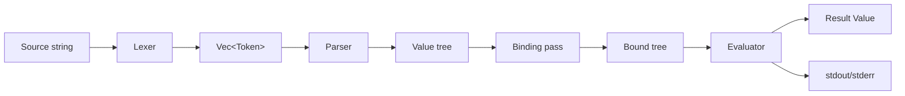
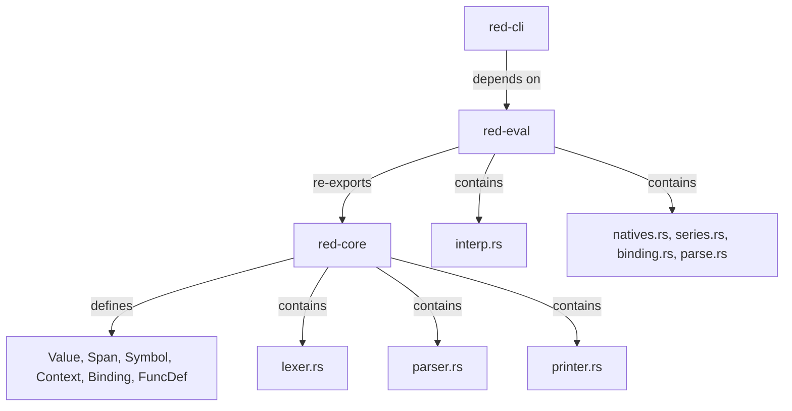

# Architecture

Implementation sketch for the lexer, parser, and evaluator. Companion to
`project-brief.md` (features/scope) — this doc covers *how* each phase works
internally: data structures, dispatch logic, error handling, and hot-path
pseudocode.

## Overview



Crates and ownership:



## Shared types (red-core)

```rust
pub struct Span { pub start: usize, pub end: usize }  // byte offsets

pub struct Symbol(pub Rc<str>);   // interned via `Rc<str>` (string_cache tried & dropped)

pub struct Series {
    pub data: Rc<RefCell<Vec<Value>>>,
    pub index: usize,
}

pub enum Binding {
    Unbound,
    Local(Context, usize),
    Func(usize),   // function-local slot; resolved via the active call frame
}

pub struct FuncDef {
    pub params: Vec<Symbol>,
    pub refinements: Vec<(Symbol, Vec<Symbol>)>,  // (refinement word, its arg words) — M13
    pub locals: Vec<Symbol>,                      // explicit `<local>` words for `function` — M16
    pub body: Series,
    pub ctx: Context,
    pub native: Option<NativeFn>,
    pub variadic: bool,
    pub infix: bool,
}

pub type NativeFn = fn(&[Value], &RefineArgs, &mut Env) -> Result<Value, EvalError>;
```

### Value variants (v0.2)

```rust
pub enum Value {
    None, Logic(bool),
    Integer { n: i64, span: Span },
    Float { f: f64, span: Span },
    String { s: Rc<str>, span: Span },
    Word { sym, binding, span }, SetWord { .. }, GetWord { .. }, LitWord { .. },
    Block { series: Series, span: Span }, Paren { series: Series, span: Span },
    Func(Rc<FuncDef>),                                    // synthetic — no span
    Path { parts: Vec<Value>, span: Span },              // foo/bar      — M19
    GetPath { parts: Vec<Value>, span: Span },           // :foo/bar     — M19
    LitPath { parts: Vec<Value>, span: Span },           // 'foo/bar     — M19
    SetPath { parts: Vec<Value>, span: Span },           // obj/field:   — M19
    Refinement { sym: Symbol, span: Span },              // /foo         — M13
    File { path: Rc<str>, span: Span },                  // %foo/bar     — M20
    Url { url: Rc<str>, span: Span },                    // http://…     — M20
    String8(Vec<u8>),                                     // binary! (POC stub)
    Error(Rc<ErrorValue>),                                // caught error value — M16
    Object(Rc<RefCell<ObjectDef>>),                      // make object! — M18 (synthetic, no span)
}
```

Every source-origin variant (`Integer`/`Float`/`String`/word-family/`Block`/`Paren`/
`Path`/`GetPath`/`LitPath`/`SetPath`/`Refinement`/`File`/`Url`) carries the byte-offset
`Span` of its originating token so eval-time errors can render `file:line:col:`.
Synthetic variants (`None`/`Logic`/`Func`/`String8`/`Error`/`Object`) are produced at
runtime and carry no span.

`Value`, `Context`, `Env`, `EvalError` defined as in the brief. Span flow is
covered above — synthetic variants omit the span and fall back to `Span::new(0,0)`
in error rendering.

## Lexer (`red-core/src/lexer.rs`)

### Types

```rust
pub enum TokenKind {
    Integer(i64),
    Float(f64),
    String(Rc<str>),
    Word(Symbol),
    SetWord(Symbol),
    GetWord(Symbol),
    LitWord(Symbol),
    Refinement(Symbol),   // /foo — M13
    File(Rc<str>),         // %foo/bar — M20
    Url(Rc<str>),          // scheme://… detected inside a word run — M20
    LBracket, RBracket,
    LParen,  RParen,
}

pub struct Token {
    pub kind: TokenKind,
    pub span: Span,
}

pub enum LexError {
    UnterminatedString { span: Span },
    InvalidNumber { span: Span, chars: String },
    InvalidWord { span: Span },
    UnbalancedBrace { span: Span, depth: i32 },
}
```

### Scan loop (pseudocode)

```
fn lex(src: &str) -> Result<Vec<Token>, LexError>:
  let mut out = []
  let mut i = 0
  while i < src.len():
    c = src[i]
    if c is whitespace: i++; continue
    if c == ';': skip to EOL; continue
    if c == '[': push LBracket; i++; continue
    if c == ']': push RBracket; i++; continue
    if c == '(' : push LParen;  i++; continue
    if c == ')': push RParen; i++; continue
    if c == '"': (span, s, i) = scan_quoted(src, i)?
    if c == '{': (span, s, i) = scan_braced(src, i)?
    if c is digit or ('-' followed by digit):
        (span, tok, i) = scan_number(src, i)?
    else:
        (span, tok, i) = scan_word(src, i)?   // also catches :foo 'foo foo:
    push Token { kind: tok, span }
  return out
```

### Per-token scanners

- `scan_number`: read run of `[0-9]`, then optional `.` + digits → Float, else
  Integer. Reject `1.2.3`. Honor `e`/`E` exponent for floats.
- `scan_quoted` (`"..."`): read until unescaped `"`. Escape table: `\"`, `\\`,
  `\n`, `\t`, `\r`, `^H` etc. Error if EOF before closing quote.
- `scan_braced` (`{...}`): depth counter starting at 1; nested `{`/`}` adjust.
  Newlines preserved. Error if EOF with depth > 0.
- `scan_word`: read run of non-delimiter chars (delimiters = whitespace,
  `[](){},;"`). Then classify:
  - leading `:` → GetWord
  - leading `'` → LitWord
  - trailing `:` → SetWord (single trailing colon only)
  - otherwise → Word
  Intern each symbol immediately.

### Error strategy
Single-character lookahead, no backtracking. Every error carries a `Span`
so the parser/CLI can point at the offending bytes.

## Parser (`red-core/src/parser.rs`)

### Types

```rust
pub struct Parser<'a> {
    tokens: &'a [Token],
    pos: usize,
}

pub enum ParseError {
    Unexpected { found: TokenKind, span: Span, expected: &'static str },
    MissingClose { open: Span, kind: &'static str },
    EmptyInput,
}
```

### Entry points

```rust
pub fn parse_program(toks: &[Token]) -> Result<(Series /*header*/, Series /*body*/), ParseError>;
pub fn load(toks: &[Token]) -> Result<Series /*body*/, ParseError>;  // bare body
```

### parse_value dispatch (pseudocode)

```
fn parse_value(&mut self) -> Result<Value, ParseError>:
  tok = self.peek()?
  match tok.kind:
    LBracket: return self.parse_block()       // consumes [ ... ]
    LParen:   return self.parse_paren()        // consumes ( ... )
    Integer(n) => advance; Value::Integer(n)
    Float(f)   => advance; Value::Float(f)
    String(s)  => advance; Value::String(s)
    Word(w)    => advance; Value::Word { sym: w, binding: Unbound }
    SetWord(w) => advance; Value::SetWord { sym: w, binding: Unbound }
    GetWord(w) => advance; Value::GetWord { sym: w, binding: Unbound }
    LitWord(w) => advance; Value::LitWord(w)
    other: Err(Unexpected { ... })
```

### parse_block (pseudocode)

```
fn parse_block(&mut self) -> Result<Value, ParseError>:
  open = self.consume(LBracket)?
  let mut items = vec![]
  while self.peek()?.kind != RBracket:
    if at EOF: Err(MissingClose { open, kind: "block" })
    items.push(self.parse_value()?)
  close = self.consume(RBracket)?
  return Value::Block(Series {
      data: Rc::new(RefCell::new(items)),
      index: 0,
  })  // span = open.start .. close.end
```

`parse_paren` is identical with `LParen`/`RParen` and `Value::Paren`.

### Header handling
`parse_program` peeks first token; if it's `Word("Red")`, consumes it,
consumes one block (header), then parses one body block. Otherwise treats
the whole stream as body (matches `load`).

### Binding pass
After the body `Series` is built, walk it recursively. For each `SetWord`
encountered at the top level of the body, allocate a fresh slot in the user
context and rewrite its `binding` to `Local(user_ctx, slot)`. For each `Word`
whose name matches a known user-context slot, attach the same binding. Words
that don't match stay `Unbound` and resolve at eval time (function locals,
natives). Function bodies are *not* bound here — they're bound when `func`/
`does` runs.

### Errors
Every error carries the span of the offending token so the CLI can render
`file.red:line:col: error: ...`.

## Evaluator (`red-eval/src/interp.rs`)

### Types

```rust
pub struct Env {
    pub user_ctx: Context,
    pub call_stack: Vec<CallFrame>,
    pub natives: HashMap<Symbol, NativeFn>,
}

pub struct CallFrame {
    pub ctx: Context,        // function-local context
    pub func: Option<Rc<FuncDef>>,
}

pub enum EvalError {
    UnboundWord { sym: Symbol, span: Span },
    TypeError { expected: &'static str, found: &'static str, span: Span },
    Arity { native: Symbol, expected: usize, got: usize, span: Span },
    Return(Value),                 // control-flow unwind from `return`
    Break(Option<Value>),          // control-flow unwind from `break`
    Continue,                      // control-flow unwind from `continue`
    Native { message: String, span: Span },
}
```

`EvalError::Display` renders just the message body (no `*** Error:` prefix,
no location). The `render_error(file: Option<&str>, src: &str, err: &Error)`
function in `red-core::error` produces the full Red-style diagnostic line
`*** Error: [file:line:col: ]<msg>` using a `LineMap` (precomputed line-start
offsets) to translate the error's byte-offset `Span` into 1-based
`line:col`. The CLI passes `Some(path)` + the file source; the REPL passes
`None` + the line buffer. Errors whose span is the zero placeholder
(`Span::new(0,0)`, used by synthetic values) omit the location.

### Main eval loop (pseudocode)

```
fn eval(block: &Value, env: &mut Env) -> Result<Value, EvalError>:
  let series = match block { Block(s) | Paren(s) => s, _ => return Ok(block.clone()) }
  let mut last = Value::None
  let data = series.data.borrow()
  let mut i = series.index
  while i < data.len():
    let v = &data[i]
    last = match v {
      Integer(_) | Float(_) | String(_) | None | Logic(_) | LitWord(_) | Block(_) | Func(_) => v.clone(),
      Paren(s) => eval(&Value::Paren(s.clone()), env)?,  // eager
      Path(parts) => eval_path(parts, env, v.span())?,
      Word { sym, binding } => resolve_word(*sym, binding, env, v.span())?,
      SetWord { sym, binding } => {
        i += 1
        let rhs = eval_one(&data[i], env)?
        write_setword(*sym, binding, rhs, env, v.span())?
        last
      }
      GetWord { sym, binding } => resolve_word(*sym, binding, env, v.span())?,
    }
    i += 1
  Ok(last)
```

### Word resolution

```
fn resolve_word(sym, binding, env, span) -> Result<Value, EvalError>:
  match binding:
    Local(ctx, slot) => Ok(ctx.slot(slot).clone()),
    Func(fd, idx)    => Ok(env.call_stack.last().unwrap().ctx.slot(idx).clone()),
    Unbound          =>
      if let Some(native) = env.natives.get(&sym): Ok(Value::Func(native_to_fd(native)))
      else: Err(UnboundWord { sym, span })
```

(POC simplification: natives are looked up by name when the word is
unbound. Real Red pre-binds native references; we defer that to keep the
binding pass simple.)

### Native dispatch
When a `Word` resolves to a `Value::Func(fd)` whose `native` is `Some(f)`:
- Collect arguments by evaluating the next N values in the current block
  (N = `fd.params.len()`).
- Call `f(args, refs, env)`.
- For non-native `Func` values (user-defined via `func`/`does`):
  - Push a `CallFrame { ctx: child_ctx(fd), func: Some(fd) }` where
    `child_ctx` binds each param symbol to the corresponding arg.
  - `eval(&Value::Block(fd.body.clone()), env)`
  - Pop frame.
- `return` native: `Err(EvalError::Return(value))` caught by the function
  call shim and converted to the return value.

### Refinement dispatch (M13)
A function spec may declare refinements: `func [x /with y]` populates
`FuncDef.refinements` with `("with", ["y"])`. At a call site, refinements
arrive in two shapes:
- **Path form** (`copy/part x`) — the parser folds `copy` + `/part` into a
  `Value::Path` whose tail words are extracted as *leading refinements*
  before dispatch.
- **Spaced form** (`copy /part x`) — `collect_call_args` peeks the next
  value; a matching `Value::Refinement` token is consumed and the
  refinement is activated.

`collect_call_args` walks positional params first, then `fd.refinements`
in declaration order. An activated refinement collects its arg words; an
absent refinement contributes nothing. The result is `args: &[Value]`
plus a `RefineArgs` map of `name -> &[Value]`. `NativeFn` takes both:
`fn(args, refs, env)`. Natives query `refs.has(&sym)` / `refs.get(&sym)`.
Refinement-arg exhaustion raises `EvalError::Native` naming the offending
refinement (e.g. `"copy: refinement /part expects 1 argument(s), got 0"`)
rather than a generic arity message.

### Path resolution (M19)
`Value::Path` (and `GetPath`/`LitPath`/`SetPath`) is assembled by the
parser when a word is immediately followed by `/word` tokens. Evaluation:
- **Function-headed** (`copy/part …`) — the tail is treated as leading
  refinements and dispatched via the refinement collector above.
- **Object-headed** (`obj/field`) — `obj` resolves, then `select_object_path`
  walks the tail. Each `Word` part selects an object slot; the final part
  may be a method call if the selected value is a `Func` and trailing
  block args are available.
- **Data-headed** (`block/2`, `string/3`) — `walk_data_path` steps through
  the tail: `Word` → object field select; `Integer` → 1-based `pick`
  (negative from tail, out-of-range → `none`); `Paren` → evaluated in
  place as the selector (`b/(1 + 1)`).

Per-step errors (missing field, type mismatch) localize to the offending
part's own span, not the whole path's. `SetPath` (`obj/field: value`)
walks to the second-to-last part, then writes the evaluated RHS into the
final field (object slot) or index (`poke`).

### Objects (M18)
`Value::Object(Rc<RefCell<ObjectDef>>)` wraps an ordered word→value
`Context` plus an optional prototype `parent`. `make object! [spec]`
evaluates the spec block with `self` bound to a fresh context; set-words
in the spec populate slots. Inheritance is copy-based: a child
`make object! parent [...]` pre-seeds from the parent's words/values, then
evaluates the spec (which may override). Method bodies bind to the
object's context via the standard binding pass — no special binding
variant. `in object 'word` returns a `Word` bound into the object's slot;
`words-of`/`values-of`/`reflect` introspect it.

### Block vs Paren
`eval` walks both `Block` and `Paren` the same way when entered explicitly.
The difference is *who enters*:
- A `Block` value sitting in a block being walked is **not** entered — it's
  returned as data (matches the loop's pattern: `Block(_) => v.clone()`).
- A `Paren` value sitting in a block being walked **is** entered eagerly
  (the `Paren(s) => eval(...)` arm).
- Natives like `do`, `if`, `loop`, `parse` receive a `Block` argument and
  call `eval` on it themselves.

### Series natives
Live in `series.rs`, registered in `natives.rs`. Each takes `&[Value]`,
extracts its `Series` argument(s), manipulates the cursor or `RefCell`
contents, returns a `Value`. Mutation affects shared storage (Red
reference semantics).

### Error propagation
`?` everywhere. `EvalError::Return` is the only "non-error error" — caught
by the function-call shim, not by `eval` itself. Span comes from the
offending value (every `Value` reachable in eval has its span, either
inline or via its `Series`'s token span).

## Cross-cutting

- **Span flow**: lex→parse→eval. Every source-origin `Value` carries its
  token span; synthetic variants (`None`/`Logic`/`Func`/`String8`/`Error`/
  `Object`) carry none and fall back to the zero span. Path-step errors
  localize to the offending part's span; `load %file` parse errors fold
  the loaded file's `file:line:col:` into the message body (the separate
  source buffer isn't visible to the outer `render_error`).
- **Symbol interning**: `Symbol(Rc<str>)` — `string_cache` was tried early
  on but dropped in favor of the simpler `Rc<str>` newtype (no profiling
  need surfaced).
- **Sharing & mutation**: `Rc<RefCell<...>>` for `Series` data and Context
  slots. No GC, no borrowing across the eval loop.
- **Single-threaded**: no `Send`/`Sync` requirements; `Env` is `!Send`.
- **No precedence parsing**: Red is prefix/eager, so the parser has no
  expression grammar — every value is one token (or one bracketed group).
- **Printer round-trip gaps (POC)**: `Func` molds as `#[function]`,
  `String8` as `#{hex}`, `Error` as `make error! "..."`, and `NaN`/`inf`
  floats have no lexer literal — none reparse. The property test in
  `red-core/tests/property.rs` excludes these variants (and `Object`,
  which is not source-origin). Positioned series (`index != 0`) also
  don't round-trip to their head form (mold renders from the cursor).
- **Deferred to v0.3+** (acknowledged, not built): `char!`, `map!`,
  `pair!`, `tuple!`, `date!`, `bitset!`, modules/`import`, error values
  as fully first-class data, `compose`, the full port model, trig math,
  and `parse` advanced rules (`collect`/`keep`/`match`/`case` flag).

## Testing touchpoints

| Phase    | Test style                | Location                       |
|----------|---------------------------|--------------------------------|
| Lexer    | Inline `#[test]` per kind | `red-core/src/lexer.rs`        |
| Parser   | Golden round-trip         | `red-core/tests/round_trip.rs` |
| Evaluator| Golden program fixtures   | `red-eval/tests/programs.rs`   |
| CLI      | `assert_cmd` end-to-end   | `red-cli/tests/cli.rs`         |

Golden fixtures are file-driven: drop a `*.red` + `*.expected` pair, get a
test for free.
