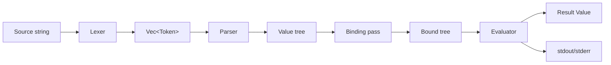
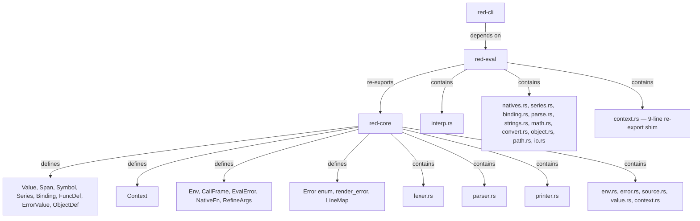

# Architecture

Implementation sketch for the lexer, parser, and evaluator. Companion to
`project-brief.md` (features/scope) — this doc covers *how* each phase works
internally: data structures, dispatch logic, error handling, and hot-path
pseudocode.

## Overview



Crates and ownership:



Note: `Env` / `CallFrame` / `EvalError` / `NativeFn` / `RefineArgs` live in
**`red-core/src/env.rs`** (so the error model and call-frame types are available
to the printer and parser without depending on red-eval). `red-eval/src/context.rs`
is a 9-line `pub use` re-export of those names plus `Context`/`Binding`/`FuncDef`.

## Shared types (red-core)

```rust
pub struct Span { pub start: usize, pub end: usize }  // byte offsets
// derives Clone, Copy, Debug, PartialEq, Eq; Default = Span::new(0,0); is_default() helper

pub struct Symbol(pub Rc<str>);   // interned via `Rc<str>` (string_cache tried & dropped).
                                  // derives Clone, Debug, PartialEq, Eq, Hash

pub struct Series {
    pub data: Rc<RefCell<Vec<Value>>>,
    pub index: usize,
}

pub enum Binding {
    Unbound,
    Local(Rc<Context>, usize),   // shared context + slot index
    Func(usize),   // function-local slot; resolved via the active call frame
}

pub struct FuncDef {
    pub params: Vec<Symbol>,
    pub refinements: Vec<(Symbol, Vec<Symbol>)>,  // (refinement word, its arg words) — M13
    pub locals: Vec<Symbol>,                      // explicit `<local>` words for `function` — M16
    pub body: Series,
    pub ctx: Context,            // definition context (owned; cloned per call)
    pub native: Option<NativeFn>,
    pub variadic: bool,
    pub infix: bool,
}

pub type NativeFn = fn(&[Value], &RefineArgs, &mut Env) -> Result<Value, EvalError>;

pub struct RefineArgs {
    inner: Vec<(Symbol, Vec<Value>)>,   // ordered pairs, NOT a HashMap
}
// API: RefineArgs::empty(), from_pairs(Vec), has(&Symbol) -> bool, get(&Symbol) -> Option<&[Value]>

pub struct ErrorValue { pub message: String }   // M16; fuller error model (code/type/args) deferred

pub struct ObjectDef {                          // M18
    pub ctx: Rc<Context>,
    pub parent: Option<Rc<RefCell<ObjectDef>>>,
    pub self_word: Symbol,                      // seeded with Symbol::new("self")
}
```

### Value variants (v0.2)

```rust
pub enum Value {
    None, Logic(bool),
    Integer { n: i64, span: Span },
    Float { f: f64, span: Span },
    String { s: Rc<str>, span: Span },
    Word { sym, binding, span }, SetWord { .. }, GetWord { .. }, LitWord { .. },
    Block { series: Series, span: Span }, Paren { series: Series, span: Span },
    Func(Rc<FuncDef>),                                    // synthetic — no span
    Path { parts: Vec<Value>, span: Span },              // foo/bar      — M19
    GetPath { parts: Vec<Value>, span: Span },           // :foo/bar     — M19
    LitPath { parts: Vec<Value>, span: Span },           // 'foo/bar     — M19
    SetPath { parts: Vec<Value>, span: Span },           // obj/field:   — M19
    Refinement { sym: Symbol, span: Span },              // /foo         — M13
    File { path: Rc<str>, span: Span },                  // %foo/bar     — M20
    Url { url: Rc<str>, span: Span },                    // http://…     — M20
    String8(Vec<u8>),                                     // binary! (POC stub)
    Error(Rc<ErrorValue>),                                // caught error value — M16
    Object(Rc<RefCell<ObjectDef>>),                      // make object! — M18 (synthetic, no span)
}
```

Every source-origin variant (`Integer`/`Float`/`String`/word-family/`Block`/`Paren`/
`Path`/`GetPath`/`LitPath`/`SetPath`/`Refinement`/`File`/`Url`) carries the byte-offset
`Span` of its originating token so eval-time errors can render `file:line:col:`.
Synthetic variants (`None`/`Logic`/`Func`/`String8`/`Error`/`Object`) are produced at
runtime and carry no span.

`Value`, `Context`, `Env`, `EvalError` defined as in the brief. Span flow is
covered above — synthetic variants omit the span and fall back to `Span::new(0,0)`
in error rendering.

## Lexer (`red-core/src/lexer.rs`)

### Types

```rust
pub enum TokenKind {
    Integer(i64),
    Float(f64),
    String(Rc<str>),
    Word(Symbol),
    SetWord(Symbol),
    GetWord(Symbol),
    LitWord(Symbol),
    Refinement(Symbol),   // /foo — M13
    File(Rc<str>),         // %foo/bar — M20
    Url(Rc<str>),          // scheme://… detected inside a word run — M20
    LBracket, RBracket,
    LParen,  RParen,
}

pub struct Token {
    pub kind: TokenKind,
    pub span: Span,
}

pub enum LexError {
    UnterminatedString { span: Span },
    InvalidNumber { span: Span, chars: String },
    InvalidWord { span: Span },
    UnbalancedBrace { span: Span, depth: i32 },
}
```

### Scan loop (pseudocode)

```
fn lex(src: &str) -> Result<Vec<Token>, LexError>:
  let mut out = []
  let mut i = 0
  while i < src.len():
    c = src[i]
    if c is whitespace or c == ',': i++; continue   // ',' is whitespace (Red)
    if c == ';': skip to EOL; continue
    if c == '[': push LBracket; i++; continue
    if c == ']': push RBracket; i++; continue
    if c == '(' : push LParen;  i++; continue
    if c == ')': push RParen; i++; continue
    if c == '"': (span, s, i) = scan_quoted(src, i)?
    if c == '{': (span, s, i) = scan_braced(src, i)?
    if c is digit or ('-' followed by digit):
        (span, tok, i) = scan_number(src, i)?
    else:
        (span, tok, i) = scan_word(src, i)?   // also catches :foo 'foo foo: %file url://...
    push Token { kind: tok, span }
  return out
```

### Per-token scanners

- `scan_number`: read run of `[0-9]`, then optional `.` + digits → Float, else
  Integer. Reject `1.2.3`. Honor `e`/`E` exponent for floats.
- `scan_quoted` (`"..."`): read until unescaped `"`. Escape table: `\"`, `\\`,
  `\n`, `\t`, `\r`; **unknown escapes are kept verbatim with the backslash**
  (e.g. `"\q"` yields `\q`). No `^H`-style caret escapes — those are deferred.
  Error if EOF before closing quote.
- `scan_braced` (`{...}`): depth counter starting at 1; nested `{`/`}` adjust.
  Newlines preserved. Error if EOF with depth > 0.
- `scan_word`: read run of non-delimiter chars. Delimiter set = whitespace +
  `,` + `[` `]` `(` `)` `{` `}` `;` `"` `/`. (Note `/` is a delimiter so
  `foo/bar` splits into `Word("foo") Refinement("bar")` — the parser re-folds
  these into a `Path`.) Then classify:
  - leading `:` → GetWord
  - leading `'` → LitWord
  - leading `%` → File (bare `%foo/bar.txt` or quoted `%"with spaces.txt"`)
  - trailing `:` → SetWord (single trailing colon only)
  - `scheme://...` (alpha scheme + literal `://`) → Url
  - bare `/` (not followed by word chars / digit) → `Word("/")` (division)
  - bare `//` → `Word("//")` (modulo operator, one token)
  - otherwise → Word
  Intern each symbol immediately.

### Error strategy
Single-character lookahead, no backtracking. Every error carries a `Span`
so the parser/CLI can point at the offending bytes.

## Parser (`red-core/src/parser.rs`)

### Types

```rust
pub struct Parser<'a> {
    tokens: &'a [Token],
    pos: usize,
}

pub enum ParseError {
    Unexpected { found: TokenKind, span: Span, expected: &'static str },
    MissingClose { open: Span, kind: &'static str },
    EmptyInput,
}
```

### Entry points

```rust
pub fn parse_program(toks: &[Token]) -> Result<(Series /*header*/, Series /*body*/), ParseError>;
pub fn load(toks: &[Token]) -> Result<Series /*body*/, ParseError>;  // bare body
pub fn load_source(src: &str) -> Result<Series /*body*/, Error>;     // lex + load in one call
```

### parse_value dispatch (pseudocode)

```
fn parse_value(&mut self) -> Result<Value, ParseError>:
  tok = self.peek()?
  match tok.kind:
    LBracket: return self.parse_block()       // consumes [ ... ]
    LParen:   return self.parse_paren()        // consumes ( ... )
    Integer(n) => advance; Value::Integer(n)
    Float(f)   => advance; Value::Float(f)
    String(s)  => advance; Value::String(s)
    Word(w)    => advance; Value::Word { sym: w, binding: Unbound }
    SetWord(w) => advance; Value::SetWord { sym: w, binding: Unbound }
    GetWord(w) => advance; Value::GetWord { sym: w, binding: Unbound }
    LitWord(w) => advance; Value::LitWord(w)
    other: Err(Unexpected { ... })
```

### parse_block (pseudocode)

```
fn parse_block(&mut self) -> Result<Value, ParseError>:
  open = self.consume(LBracket)?
  let mut items = vec![]
  while self.peek()?.kind != RBracket:
    if at EOF: Err(MissingClose { open, kind: "block" })
    items.push(self.parse_value()?)
  close = self.consume(RBracket)?
  return Value::Block(Series {
      data: Rc::new(RefCell::new(items)),
      index: 0,
  })  // span = open.start .. close.end
```

`parse_paren` is identical with `LParen`/`RParen` and `Value::Paren`.

### Header handling
`parse_program` peeks first token; if it's `Word("Red")`, consumes it,
consumes one header block (must be `[...]`), then parses **the rest of the
stream as a flat body `Series`** (the body need not be wrapped in its own
`[...]`). Otherwise treats the whole stream as body (matches `load`).

### Path assembly (parser-level)
`parse_value` folds adjacent `Refinement` tokens (and `Word("/")`+value pairs
for paren/integer parts) into a single `Path`/`GetPath`/`LitPath`/`SetPath`
*inline* during the recursive descent — there is no separate post-pass. The
head determines the variant: `Word`→`Path`, `GetWord`→`GetPath`,
`LitWord`→`LitPath`. `SetPath` (`obj/field:`) is detected when the trailing
`SetWord`'s name matches the last `Refinement` and their spans overlap (the
lexer emits `Word(obj) Refinement(field) SetWord(field)` with overlapping
spans — see lexer's `scan_word`). Path parts may include `Paren`
(e.g. `foo/(1 + 2)/bar`).

### Binding pass
**The parser does NOT bind words.** Binding is a separate pass in
`red-eval/src/binding.rs`, invoked from `interp::run_series_inner_opts`
(and from the REPL) right before evaluation. The pass walks the body
recursively and attaches `Binding`s using the user context:

- `collect_setwords` — every `SetWord` at the top level of the body allocates
  a fresh slot in the user context and rewrites its `binding` to
  `Local(user_ctx, slot)`. Matching `Word`s get the same binding.
- `collect_loop_vars` — names bound by `repeat`/`foreach`/`forall` are
  pre-allocated as locals so the iteration word resolves.
- `collect_parse_words` — `copy`/`set` capture words inside a `parse` rule
  block are bound into the user context.
- `use`/`get`/`set`/`value?` operands are also wired so their word argument
  resolves to the right context slot.

Words that don't match anything stay `Unbound` and resolve at eval time
(function locals, natives). Function bodies are *not* bound here — they're
bound when `func`/`does`/`function`/`make object!` runs (via
`bind_function_body`, which binds field references to the function's or
object's context).

### Errors
Every error carries the span of the offending token so the CLI can render
`file.red:line:col: error: ...`.

## Evaluator (`red-eval/src/interp.rs` + `interp_walker.rs`)

Since M29 (v0.3), the evaluator is split into a thin dispatch shim
(`interp.rs`) and the original tree-walker (`interp_walker.rs`). The
default mode is the bytecode VM (`EvalMode::Vm`); `--walk` on the CLI or
the `force-walk` cargo feature forces the tree-walker. The shim's
`eval(block, env)` checks `env.mode`: `Walk` → `interp_walker::eval`
directly; `Vm` → `dispatch_block` (compile-on-demand + `vm::run`, falling
back to the walker for `needs_rebind`/foreign-bound/compile-error blocks).
`run_series_inner_opts` calls `dispatch_block` (not `eval` directly) so the
top-level script body honors `env.mode`. `call_user_func` (the walker's
function-call shim) calls `interp_walker::eval` directly — function bodies
invoked from the walker always stay on the walker (the VM uses its own
`vm.frames`, not `env.call_stack`). In pure VM mode, the VM's `CallUser`
handler is the function-invocation path.

### Types

```rust
pub struct Env {
    pub user_ctx: Rc<Context>,                 // shared (Rc) so the REPL & binding pass can mutate
    pub call_stack: Vec<CallFrame>,
    pub natives: HashMap<Symbol, Rc<FuncDef>>, // full FuncDef so infix/variadic/refinements flow
    pub out: Box<dyn Write>,                   // stdout sink; tests inject a buffer
    pub allow_shell: bool,                     // M20: gates `call`/`shell`
    pub cwd: PathBuf,                          // M20: base dir for file I/O
}

pub struct CallFrame {
    pub ctx: Context,        // function-local context (owned, cloned per call)
    pub func: Option<Rc<FuncDef>>,
}

pub enum EvalError {
    UnboundWord { sym: Symbol, span: Span },
    TypeError { expected: &'static str, found: &'static str, span: Span },
    Arity { native: Symbol, expected: usize, got: usize, span: Span },
    Return(Value),                 // control-flow unwind from `return`
    Break(Option<Value>),          // control-flow unwind from `break`
    Continue,                      // control-flow unwind from `continue` (no value)
    Throw(Value),                  // M16: `throw` / `catch` unwind
    Quit(i32),                     // M16: `exit` / `quit` unwind (process exit code)
    Native { message: String, span: Span },
}
```

`Env`, `CallFrame`, `EvalError`, `NativeFn`, and `RefineArgs` are all defined
in **`red-core/src/env.rs`** (so red-core's printer/parser can mention
`EvalError`/`Error` without a red-eval dependency). `red-eval/src/context.rs`
is just `pub use red_core::{Binding, CallFrame, Context, Env, EvalError,
FuncDef, NativeFn, RefineArgs};`.

`EvalError::span()` returns `Some(span)` for `UnboundWord`/`TypeError`/
`Arity`/`Native` and `None` for every control-flow unwind (`Return`/`Break`/
`Continue`/`Throw`/`Quit`). `EvalError::Display` renders just the message
body (no `*** Error:` prefix, no location). The `render_error(file:
Option<&str>, src: &str, err: &Error)` function in `red-core/src/error.rs`
produces the full Red-style diagnostic line `*** Error:
[file:line:col: ]<msg>` using a `LineMap` (defined in
`red-core/src/source.rs`, precomputed line-start offsets) to translate the
error's byte-offset `Span` into 1-based `line:col`. The CLI passes
`Some(path)` + the file source; the REPL passes `None` + the line buffer.
Errors whose span is `None` or the zero placeholder (`Span::new(0,0)`, used
by synthetic values) omit the location. `Error` (also in
`red-core/src/error.rs`) is the unified `enum { Lex, Parse, Eval }` with
`From` impls for each sub-error.

### Main eval loop (pseudocode)

```
fn eval(block: &Value, env: &mut Env) -> Result<Value, EvalError>:
  let series = match block { Block(s) | Paren(s) => s, _ => return Ok(block.clone()) }
  let mut last = Value::None
  let data = series.data.borrow()
  let mut i = series.index
  while i < data.len():
    let v = &data[i]
    last = match v {
      Integer(_) | Float(_) | String(_) | None | Logic(_) | LitWord(_) | Block(_) | Func(_) => v.clone(),
      Paren(s) => eval(&Value::Paren(s.clone()), env)?,  // eager
      Path(parts) => eval_path(parts, env, v.span())?,
      Word { sym, binding } => resolve_word(*sym, binding, env, v.span())?,
      SetWord { sym, binding } => {
        i += 1
        let rhs = eval_one(&data[i], env)?
        write_setword(*sym, binding, rhs, env, v.span())?
        last
      }
      GetWord { sym, binding } => resolve_word(*sym, binding, env, v.span())?,
    }
    i += 1
  Ok(last)
```

### Word resolution

```
fn resolve_word(sym, binding, env, span) -> Result<Value, EvalError>:
  match binding:
    Local(ctx, slot) => Ok(ctx.slot(slot).clone()),
    Func(fd, idx)    => Ok(env.call_stack.last().unwrap().ctx.slot(idx).clone()),
    Unbound          =>
      if let Some(native) = env.natives.get(&sym): Ok(Value::Func(native_to_fd(native)))
      else: Err(UnboundWord { sym, span })
```

(POC simplification: natives are looked up by name when the word is
unbound. Real Red pre-binds native references; we defer that to keep the
binding pass simple.)

### Native dispatch
The `Env.natives` map stores `Rc<FuncDef>` (not bare `NativeFn`) so the
`infix`/`variadic`/`refinements`/`locals` metadata flows through to dispatch.
When a `Word` resolves to a `Value::Func(fd)` whose `native` is `Some(f)`:
- Collect arguments by evaluating the next N values in the current block
  (N = `fd.params.len()`).
- Call `f(args, refs, env)`.
- For non-native `Func` values (user-defined via `func`/`does`):
  - Push a `CallFrame { ctx: child_ctx(fd), func: Some(fd) }` where
    `child_ctx` binds each param symbol to the corresponding arg.
  - `eval(&Value::Block(fd.body.clone()), env)`
  - Pop frame.
- `return` native: `Err(EvalError::Return(value))` caught by the function
  call shim and converted to the return value.

### Refinement dispatch (M13)
A function spec may declare refinements: `func [x /with y]` populates
`FuncDef.refinements` with `("with", ["y"])`. At a call site, refinements
arrive in two shapes:
- **Path form** (`copy/part x`) — the parser folds `copy` + `/part` into a
  `Value::Path` whose tail words are extracted as *leading refinements*
  before dispatch.
- **Spaced form** (`copy /part x`) — `collect_call_args` peeks the next
  value; a matching `Value::Refinement` token is consumed and the
  refinement is activated.

`collect_call_args` walks positional params first, then `fd.refinements`
in declaration order. An activated refinement collects its arg words; an
absent refinement contributes nothing. The result is `args: &[Value]`
plus a `RefineArgs` (an ordered `Vec<(Symbol, Vec<Value>)>` — not a
HashMap) of `name -> &[Value]`. `NativeFn` takes both:
`fn(args, refs, env)`. Natives query `refs.has(&sym)` / `refs.get(&sym)`.
Refinement-arg exhaustion raises `EvalError::Native` naming the offending
refinement (e.g. `"copy: refinement /part expects 1 argument(s), got 0"`)
rather than a generic arity message.

### Path resolution (M19)
`Value::Path` (and `GetPath`/`LitPath`/`SetPath`) is assembled by the
parser when a word is immediately followed by `/word` tokens. Evaluation:
- **Function-headed** (`copy/part …`) — the tail is treated as leading
  refinements and dispatched via the refinement collector above.
- **Object-headed** (`obj/field`) — `obj` resolves, then `select_object_path`
  walks the tail. Each `Word` part selects an object slot; the final part
  may be a method call if the selected value is a `Func` and trailing
  block args are available.
- **Data-headed** (`block/2`, `string/3`) — `walk_data_path` steps through
  the tail: `Word` → object field select; `Integer` → 1-based `pick`
  (negative from tail, out-of-range → `none`); `Paren` → evaluated in
  place as the selector (`b/(1 + 1)`).

Per-step errors (missing field, type mismatch) localize to the offending
part's own span, not the whole path's. `SetPath` (`obj/field: value`)
walks to the second-to-last part, then writes the evaluated RHS into the
final field (object slot) or index (`poke`).

**POC caveats:**
- **String char pick** (`"abc"/2`): returns the codepoint as an `integer!`,
  not a `char!` — `char!` is deferred to v0.3. String char *poke* errors.
- **Block-integer SetPath** (`b/2: 99`): the evaluator supports writing via
  an integer index, but it's **unreachable from source** because the lexer
  can't tokenize `2:` (a digit run immediately followed by `:`). The lexer
  would need a `SetInteger`/`Integer`+`SetWord` split to enable this.
  Object-field set-paths (`obj/field: …`) work fine.
- **Path-conversion natives** (in `path.rs`, registered alongside the path
  machinery): `path?`, `get-path?`, `lit-path?`, `to-path`, `to-get-path`,
  `to-lit-path`. (`set-path?` is intentionally omitted.)

### Objects (M18)
`Value::Object(Rc<RefCell<ObjectDef>>)` wraps an ordered word→value
`Context` plus an optional prototype `parent`. `make object! [spec]`
evaluates the spec block with `self` bound to a fresh context; set-words
in the spec populate slots. Inheritance is copy-based: a child
`make object! parent [...]` pre-seeds from the parent's words/values, then
evaluates the spec (which may override). Method bodies bind to the
object's context via the standard binding pass — no special binding
variant. `in object 'word` returns a `Word` bound into the object's slot
(registered in `object.rs`, not `binding.rs`); `words-of`/`values-of`/
`reflect` introspect it. The `object` and `context` keywords are aliases
for `make object!` (arity 1, spec block). Object predicates:
`object?`, `same?`, `not-same?`.

### Block vs Paren, system, and entry points
- **Block vs Paren (recap)**: a `Block` sitting in a block being walked is
  returned as data; a `Paren` is entered eagerly. Natives like `do`, `if`,
  `loop`, `parse` receive a `Block` argument and call `eval` on it
  themselves. (`compose` is **not** implemented — deferred to v0.3; don't
  expect it in the block-walker list.)
- **`system` constant**: `install_system` seeds a `system` object into the
  user context exposing `system/options/args` (trailing CLI args),
  `system/options/allow-shell` (mirrors `Env.allow_shell`), and
  `system/options/path` (mirrors `Env.cwd`, kept in sync by `change-dir`).
- **Entry points**: `interp` exposes `eval` (the inner loop) plus
  `run_source*` / `run_series_with_exit_opts` helpers driven by
  `RunOptions { allow_shell, args }`. `run_source_with_exit` returns
  `(Option<Value>, i32)` so the CLI can propagate the `quit`/`exit` code.

### Series natives
Live in `series.rs`, registered in `natives.rs`. Each takes `&[Value]`,
extracts its `Series` argument(s), manipulates the cursor or `RefCell`
contents, returns a `Value`. Mutation affects shared storage (Red
reference semantics).

### Error propagation
`?` everywhere. `EvalError::Return` is the only "non-error error" — caught
by the function-call shim, not by `eval` itself. Span comes from the
offending value (every `Value` reachable in eval has its span, either
inline or via its `Series`'s token span).

## Performance (v0.3.3 VM, M30 + M30.1 + M30.2 + M30.3)

The bytecode VM (M22–M29) is the default evaluator. M30 added hot-path
optimizations + an A/B bench harness (`fixtures/*` for VM,
`walk_fixtures/*` for the walker) so the two modes can be compared
directly via `critcmp`. M30.1 (v0.3.1) applied three Tier 1 speedups
that brought the loop-heavy fixtures from regression to parity with the
walker. M30.2 (v0.3.2) applied two Tier 2 speedups that made the
loop-heavy fixtures **faster than the walker**. M30.3 (v0.3.3) applied
six Tier 4 recursion speedups that cut deep-recursion overhead ~34%.
See `BENCHMARKS.md` for the full numbers; the headline findings:

**Wins:** `fib 30` (3.52×) and `ackermann 3 5` (3.91×) — the deep-
recursion cases. The loop-heavy fixtures also beat the walker:
`sum_loop` at 1.05×, `sum_while` at 1.12×, `foreach_block` at 1.09×.

**Remaining regression:** `func_call_heavy` (0.83×) — the `does`
invocation path still allocates a `Frame` per call (the `locals` Vec is
pooled, but the `Frame` struct itself is pushed/popped). This is a Tier 3
candidate (deferred).

### M30 optimizations (v0.3.0)

1. **`Instr::ConstInt`/`ConstNone`/`ConstBool`** (in `red-core/src/vm_ir.rs`)
   — small-value fast paths that skip the pool indirection for the common
   literal kinds. The compiler (`emit_const` in `compiler.rs`) emits these
   in preference to `Const(idx)` for matching literals; the VM's `Const`
   arm shrinks from a `block_pool` lookup + `Value` clone to an inline
   `Value::Integer` construction. The `if`/`either` false-branch `none`
   push uses `ConstNone` (was `Const(none_idx)` + a pool entry).
2. **Frame snapshot caching** (`Vm::refresh_cache` in `vm.rs`) — the
   dispatch loop caches the top frame's `(block, instrs)` snapshot and
   only refreshes when `frame_gen` changes (bumped on frame push/pop/
   overwrite), avoiding a per-iteration `Rc` clone of the block + instrs
   slice. Tight loops hit the cache 999,999 times out of 1,000,000.
3. **Unchecked slot access** (`Context::slot_value_unchecked`/
   `set_slot_unchecked` in `red-core/src/context.rs`) — `LoadLocal`/
   `LoadGlobal`/`SetLocal`/`SetGlobal` use `get_unchecked` behind a
   `debug_assert!`. The compiler's `Scope` proved the slot exists at
   compile time; the bounds check was redundant in release.
4. **`natives_by_idx` cache** (`Env::natives_by_idx: Option<Rc<Vec<Rc<FuncDef>>>>`
   in `red-core/src/env.rs`) — the `Vec<Rc<FuncDef>>` indexed view of
   `env.natives` is built once (first `vm::run`) and cached. The original
   `build_natives_by_idx` did ~100 `Rc::clone`s per `dispatch_block` call
   (100M refcount ops for a 1M-iteration loop); the cache makes it one
   `Rc` bump per call. Invalidated by `invalidate_native_index` (called
   by `register_natives`).
5. **`dispatch_block` cache-before-foreign-check** (in
   `red-eval/src/interp_walker.rs`) — the Env-level block cache is checked
   *before* `has_foreign_bindings` (the O(n) per-value walk). A cached
   block is by construction non-foreign (the cache only stores blocks that
   passed the check on first compile), so the recheck is skipped on hits.
   Without this reorder, a 1M-iteration `repeat` paid the O(n) walk 1M
   times — the root cause of the initial v0.3.0 `sum_loop` regression.
6. **Reduced `Vm` Vec capacities** — `frames: Vec::with_capacity(8)` and
   `stack: Vec::with_capacity(16)` (was 64/256). The dispatch_block path
   runs small bodies (1-2 frames, < 8 stack slots); the larger capacities
   were over-allocating per call. (Superseded by Tier 1.C's pool reuse in
   v0.3.1 — the capacities are now irrelevant since the Vecs are reused.)
7. **`tail_call` locals reuse** — the `TailCall`/`TailReenter` handlers
   now `clear()` + `extend_from_slice` the existing `locals` Vec rather
   than dropping + reallocating, avoiding 1M `Vec` allocations in a 1M-
   deep tail-recursion loop.

### M30.1 Tier 1 optimizations (v0.3.1)

**A. Stack-allocated native args** (`Vm::call_native` in `vm.rs`):
The `Call` instr arm previously did `self.stack[len - argc..].to_vec()`
per native call — a heap allocation of `argc × ~64 bytes` per call. For
`repeat 1000000 [acc: acc + 1]`, the `+` native alone caused 1M heap
allocations. Research confirmed the clone was unnecessary: natives
receive `&mut Env` (not `&mut Vm`), so they cannot touch the caller's
`Vm.stack`; re-entrant natives (`if`/`loop`/etc.) create a fresh `Vm`
via `dispatch_block`, leaving the caller's stack untouched. Fix: copy
args into a stack-allocated `[MaybeUninit<Value>; 8]` for argc ≤ 8;
fall back to `to_vec()` for larger argc. Sidesteps the borrow-checker
conflict (`&self.stack[..]` vs `&mut self.env`) by copying args out
first, then passing the stack-allocated slice to `f`. The `Call` logic
was also factored out of the duplicated `run_loop`/`dispatch_instr` arms
into a single `call_native` method.

**B. `Instr: Copy` via table-indexed payloads** (`red-core/src/vm_ir.rs`):
`Instr` was ~40 bytes because `MakeFunc(u32, u32, Vec<Symbol>)` carried
a `Vec<Symbol>` (24 bytes) and `LoadDynamic(Symbol)`/`SetDynamic`/
`MarkRefine` carried `Rc<str>`. Every `instrs[pc].clone()` copied the
full 40 bytes + did an `Rc` refcount op for the `Symbol` variants. Fix:
table-index the variable-sized payloads — `MakeFunc(spec_idx, body_idx,
freevars_idx)` references `CompiledBlock::freevars_table[freevars_idx]`
(a `Vec<Vec<Symbol>>`); `LoadDynamic(sym_idx)`/`SetDynamic(sym_idx)`/
`MarkRefine(sym_idx)` reference `CompiledBlock::symbols[sym_idx]` (a
`Vec<Symbol>`). After this, every variant is `(u8 tag, u64 payload)` ≤
16 bytes, and `Instr` derives `Copy`. The dispatch loop's `instrs[pc]`
read is now a bitwise copy with no `Rc` refcount ops and no borrow-
extension across the match. The compiler's `Compiler::intern_symbol`/
`intern_freevars` helpers populate the side tables.

**C. Reusable `Vm` scratch `Vec`s** (`Env::vm_frames_pool`/
`vm_stack_pool` in `red-core/src/env.rs`, drain/restore in `vm.rs`):
Each `dispatch_block` → `vm::run` previously allocated a fresh
`Vm { frames: Vec::with_capacity(8), stack: Vec::with_capacity(16), ... }`
— 2 heap allocations per call. For `repeat 1000000`, that was 2M heap
allocations just for the dispatch shim. Fix: `vm::run` drains
`env.vm_frames_pool`/`env.vm_stack_pool` via `std::mem::take` on entry,
uses them, clears them, and drains them back on exit. The pools stay at
their high-water capacity across calls, so subsequent `vm::run` calls
don't realloc. The drain/restore dance is required because `Vm` borrows
`env: &mut Env` for its whole lifetime — the pools must be extracted
before the borrow and restored after `Vm` is dropped.

### M30.2 Tier 2 optimizations (v0.3.2)

**D. Eliminate per-iteration `Rc<[Instr]>` clone** (`Vm::refresh_cache` in
`vm.rs`): `refresh_cache()` previously returned `(usize, Rc<[Instr]>)` —
one `Rc` bump per iteration on the cache-hit path. Since `Instr: Copy`
(Tier 1.B), the dispatch loop can read `instrs[pc]` directly without
holding a borrow across the match. `refresh_cache` now returns only
`usize` (the frame index); the loop indexes
`self.cached_instrs.as_ref().unwrap()[pc]` directly — zero `Rc` refcount
ops per iteration.

**E. Compile-once loop bodies with VM-internal iteration**
(`resolve_compiled_block` in `interp_walker.rs`; loop natives in
`natives.rs`/`series.rs`): the loop natives
(`repeat`/`while`/`until`/`loop`/`foreach`/`forall`) previously called
`dispatch_block` per iteration — each call paying a HashMap lookup + Rc
bumps + `CompiledBlock` clone + pool drain/restore. M30.2 added
`resolve_compiled_block`, which resolves the body's `CompiledBlock` once
(cache lookup or compile-on-demand) and returns it as `Rc<CompiledBlock>`.
The loop natives then call `vm::run((*compiled).clone(), env)` in a tight
loop, catching `EvalError::Break`/`Continue` from the result (same as the
`dispatch_block` path). The `CompiledBlock` side tables (`symbols`/
`freevars_table`) were made `Rc<[Symbol]>`/`Rc<[Vec<Symbol>]>` so the
per-iteration clone is allocation-free (one `Rc` bump per table, no
`Vec` clone). If `resolve_compiled_block` returns `None` (Walk mode or
non-VM-able block), the native falls back to the per-iteration
`dispatch_block` path.

### M30.3 Tier 4 optimizations (v0.3.3, recursion hot-path)

Six optimizations targeting the per-`CallUser` → `Return` cycle in
deep recursion (e.g. `fib 30` does ~2.7M recursive calls). Cut `fib`
34% and `ackermann` 30% vs. v0.3.2.

**1. `Frame.block: Rc<CompiledBlock>`** (`red-core/src/vm_ir.rs`):
`Frame.block` was an owned `CompiledBlock`, so every `CallUser` cloned
the whole struct (4 `Rc` bumps for instrs/pool/symbols/freevars_table +
1 `Vec<Symbol>` alloc for the `freevars` field), every `Return` dropped
it (4 decrements + 1 Vec drop), and every `refresh_cache` refresh
re-cloned it. Changing to `Rc<CompiledBlock>` makes each of these a
single `Rc` bump/decrement. The `Vm::cached_block` field also changed to
`Option<Rc<CompiledBlock>>`.

**2. Pool the `locals` Vec** (`Env::vm_locals_pool` in
`red-core/src/env.rs`; drain in `prepare_call`, save in `Return`):
`prepare_call` previously allocated `locals: vec![Value::None; n_locals]`
per call; `Return` dropped it. Now `prepare_call` drains a Vec from
`env.vm_locals_pool` (or allocates if empty), `clear()`+`resize()`s it,
and `Return` saves the popped frame's `locals` Vec back to the pool. The
pool stays at high-water capacity, so deep recursion only allocates on
the first call.

**3. Skip intermediate `args` Vec** (`prepare_call` in `vm.rs`):
`prepare_call` previously did `self.stack[len-argc..].to_vec()` to
collect args, then copied them into `locals[0..argc]`. Reordered: leave
args on the stack across `ensure_compiled` (which doesn't touch the
operand stack), copy directly from `self.stack[start..]` into `locals`,
then truncate. Eliminates 1 Vec alloc + argc clones per call.

**4. `CallUserGlobal` instr** (`red-core/src/vm_ir.rs`; compiler emission
in `compiler.rs`; dispatch in `vm.rs`): the compiler knows whether a
call target is local (depth ≥ 1) or global (depth 0). A new
`CallUserGlobal(slot, argc)` variant skips the always-failing
`frames.last().and_then(|f| f.locals.get(slot))` check in
`prepare_call` and calls `slot_value_unchecked` directly. For `fib 30`,
this fires on every recursive call. The `patch_tail_call` function
checks both `CallUser` and `CallUserGlobal` for tail-position promotion.

**5. Self-recursion `ensure_compiled` bypass** (`ensure_compiled` in
`vm.rs`): when the target `Rc<FuncDef>` is pointer-equal to the current
frame's `func` (via `Rc::ptr_eq`), the compiled block is returned from
the current frame's `block` directly, skipping the `HashMap` lookup in
`env.func_cache`. For `fib 30`, this fires on every recursive call
(~2.7M times), eliminating ~2.7M HashMap lookups. Requires Tier 4.1 (so
`Frame.block` is `Rc<CompiledBlock>` to return).

**6. Borrow instead of clone in `call_native`** (`call_native` in
`vm.rs`): `natives_by_idx.get(idx)` without `.cloned()` — the `NativeFn`
is a `fn` pointer (Copy), extracted before the mutable `self.env`
borrow. Saves 1 `Rc` bump + decrement per native call (the `+` in `fib`'s
body fires this ~1.4M times).

### Bench harness (M30 A/B comparison)

`crates/red-eval/benches/eval.rs` runs four groups:
- `fixtures/*` — VM mode end-to-end (lex + parse + bind + eval).
- `walk_fixtures/*` — `EvalMode::Walk` end-to-end (the v0.2.0 tree-walker).
- `micro/*` — VM mode, isolated `eval` cost on a pre-built `Env`.
- `micro_walk/*` — walker mode, isolated `eval` cost.

`critcmp v0.2.0 v0.3.0` compares two saved baselines; the inline
`vm_no_slower_than_walker_on_fib` test in `tests/bench_fixtures.rs`
catches gross routing regressions in `cargo test`. See
`crates/red-eval/benches/README.md` for the full workflow.

### Release build (speed-optimized)

The workspace `Cargo.toml` carries a speed-optimized `[profile.release]`:
`opt-level = 3`, `lto = true`, `codegen-units = 1`, `strip = true`.
This produces a ~2.8 MiB binary that runs `fib 30` in ~560ms (matching
the `cargo bench` numbers, which use the same `opt-level = 3`). The
main levers:
- `opt-level = 3`: full speed optimization. (Previously used
  `opt-level = "z"` for size, which made the VM 3× slower: `fib 30`
  went from 560ms to 1.52s — not worth the 900 KiB savings.)
- `lto = true` + `codegen-units = 1`: cross-crate inlining + dead-code
  elimination. The `red-core::Value::clone` calls inlined into
  `red-eval::vm::run` eliminate function-call overhead; unused native
  paths are dropped.
- `strip = true`: strips debug symbols (~500 KiB). No speed impact.

## Cross-cutting

- **Span flow**: lex→parse→eval. Every source-origin `Value` carries its
  token span; synthetic variants (`None`/`Logic`/`Func`/`String8`/`Error`/
  `Object`) carry none and fall back to the zero span. Path-step errors
  localize to the offending part's span; `load %file` parse errors fold
  the loaded file's `file:line:col:` into the message body (the separate
  source buffer isn't visible to the outer `render_error`).
- **Symbol interning**: `Symbol(Rc<str>)` — `string_cache` was tried early
  on but dropped in favor of the simpler `Rc<str>` newtype (no profiling
  need surfaced).
- **Sharing & mutation**: `Rc<RefCell<...>>` for `Series` data and Context
  slots. No GC, no borrowing across the eval loop.
- **Single-threaded**: no `Send`/`Sync` requirements; `Env` is `!Send`.
- **No precedence parsing**: Red is prefix/eager, so the parser has no
  expression grammar — every value is one token (or one bracketed group).
- **Printer round-trip gaps (POC)**: `Func` molds as `#[function]`,
  `String8` as `#{hex}`, `Error` as `make error! "..."`, and `NaN`/`inf`
  floats have no lexer literal — none reparse. The property test in
  `red-core/tests/property.rs` excludes these variants (and `Object`,
  which is not source-origin). Positioned series (`index != 0`) also
  don't round-trip to their head form (mold renders from the cursor).
- **Deferred to v0.3+** (acknowledged, not built): `char!`, `map!`,
  `pair!`, `tuple!`, `date!`, `bitset!`, full `binary!` (only the `String8`
  stub exists), modules/`import`, the structured error model
  (code/type/args — basic `Value::Error` IS in v0.2), `compose`, the full
  port model, trig math, and `parse` advanced rules
  (`collect`/`keep`/`match`/`case` flag). Block-integer SetPath
  (`b/2: 99`) is also unreachable from source due to a lexer gap.
- **Instrumentation (`stats` feature)**: `red-eval/stats` re-exports
  `red-core/stats`, which adds two counters to `Env` gated by
  `#[cfg(feature = "stats")]` — zero-cost in release builds when off (the
  fields are absent from the struct layout; a compile-time check in
  `red-core/src/env.rs` tests confirms their absence).
  - `Env::max_frame_depth: usize` — high-water mark of `call_stack.len()`
    since the last `reset_stats` call. Bumped by `call_user_func` after each
    `CallFrame` push. Used by the v0.3 VM milestones (M28) to prove
    tail-call stack bounds.
  - `Env::instr_count: u64` — count of `eval`'s outer-loop iterations since
    the last `reset_stats`. Gives an operation-count metric independent of
    wall time; M30 correlates VM instr count with walker instr count.
  - Both are reset at the top of `run_series_inner_opts` (every
    `run_source*` call). The baseline benchmark suite (`benches/eval.rs`,
    Pre-22) records v0.2.0 tree-walker numbers in `BENCHMARKS.md` for the
  v0.3 VM to compare against.

## Testing touchpoints

| Phase    | Test style                  | Location                              |
|----------|-----------------------------|---------------------------------------|
| Lexer    | Inline `#[test]` per kind   | `red-core/src/lexer.rs`               |
| Parser   | Golden round-trip           | `red-core/tests/round_trip.rs`        |
| Printer  | proptest round-trip         | `red-core/tests/property.rs`          |
| Evaluator| Golden program fixtures     | `red-eval/tests/programs.rs`          |
| Evaluator| Golden error fixtures       | `red-eval/tests/programs_errors.rs`   |
| Evaluator| Committed file fixtures     | `red-eval/tests/fixtures/`            |
| Evaluator| Bench fixture + stats tests | `red-eval/tests/bench_fixtures.rs`    |
| Bench    | criterion `eval` suite       | `red-eval/benches/eval.rs`            |
| CLI      | `assert_cmd` end-to-end     | `red-cli/tests/cli.rs`                |

Golden fixtures are file-driven: drop a `*.red` + `*.expected` pair, get a
test for free. Error fixtures assert the rendered `*** Error:` line
contains a substring. Network-dependent url tests in `io.rs` are marked
`#[ignore]` so `cargo test` stays hermetic.
